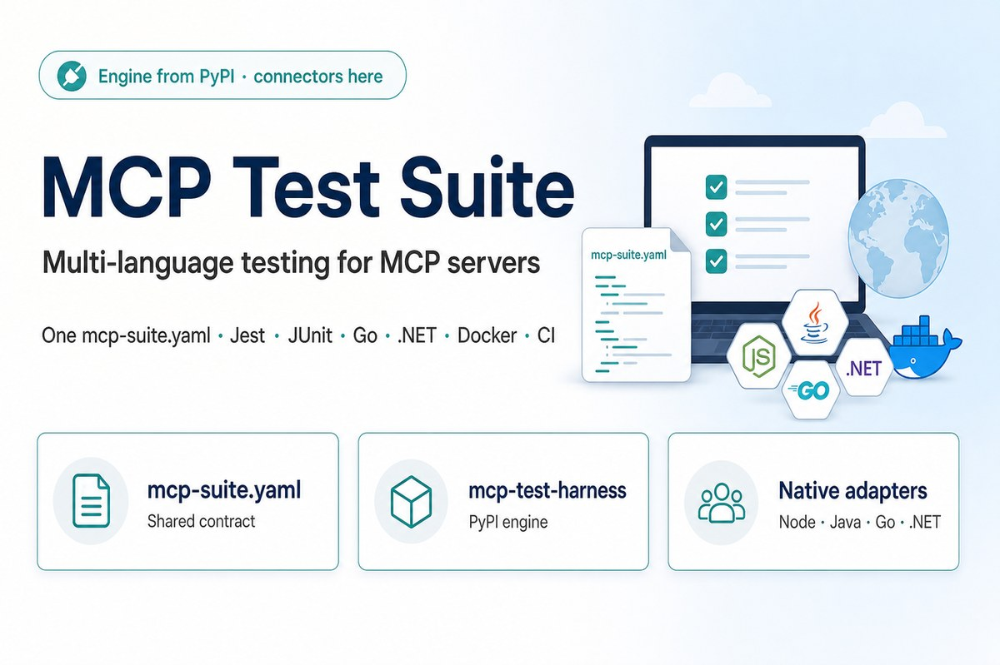
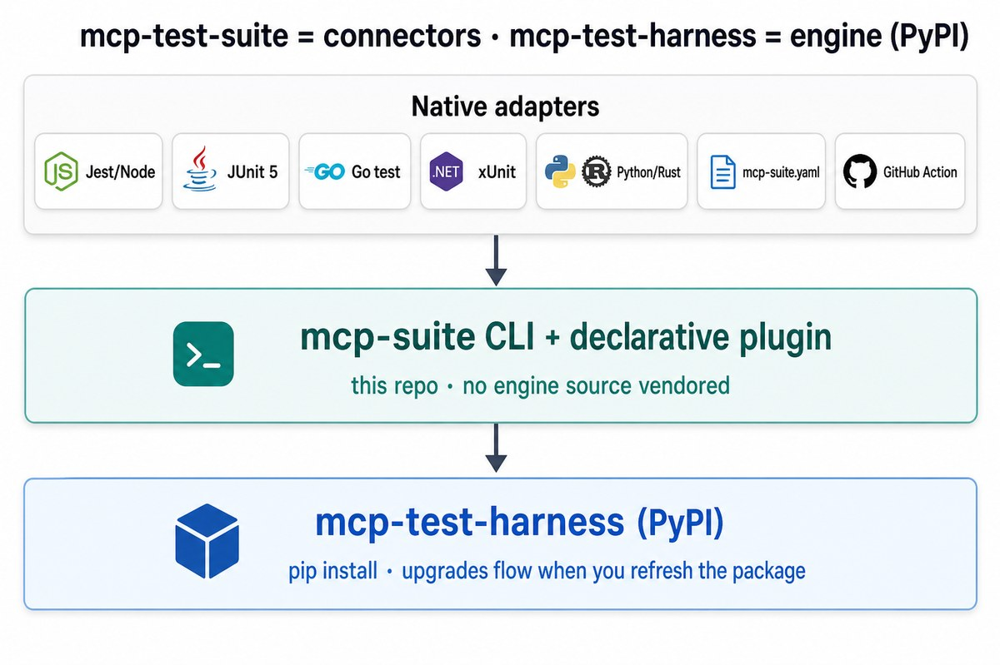
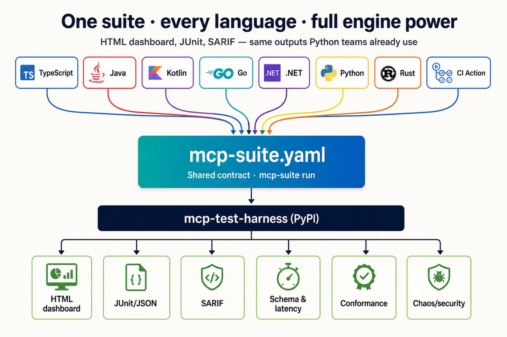
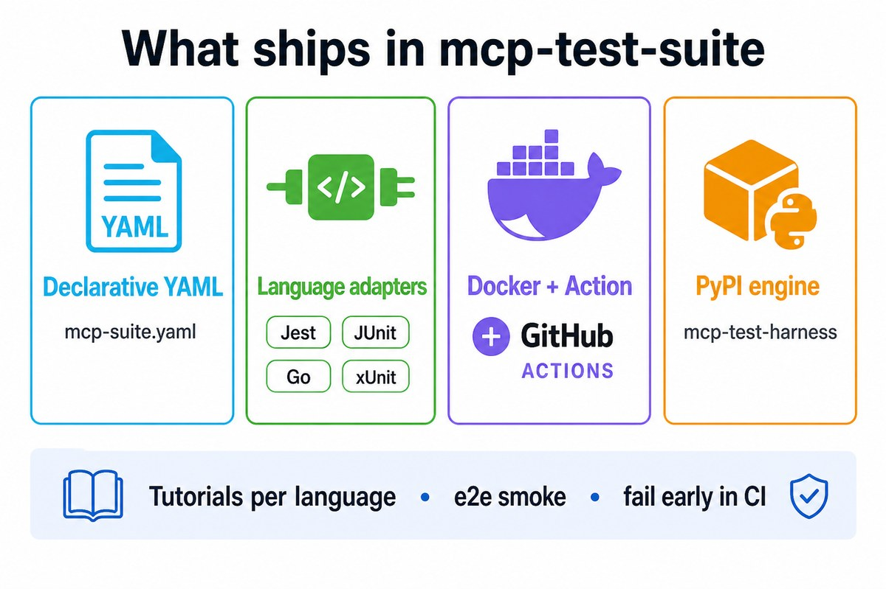

<p align="center">
  
</p>

# MCP Test Suite

> **Multi-language MCP testing.** One shared `mcp-suite.yaml`. Native adapters for Node, Java, Go, and .NET.

**Package downloads (v4.0.0):**
[Python / PyPI](https://pypi.org/project/mcp-test-harness/) ·
[Java / Maven](https://github.com/vaquarkhan/mcp-test-suite/packages/3158511) ·
[Node / npm](https://github.com/users/vaquarkhan/packages/npm/package/mcp-test-suite-jest) ·
[Go module](https://pkg.go.dev/github.com/vaquarkhan/mcp-test-suite/adapters/gotest@v4.0.0) ·
[.NET / NuGet](https://github.com/users/vaquarkhan/packages/nuget/package/McpTestSuite.Xunit) ·
[Release assets](https://github.com/vaquarkhan/mcp-test-suite/releases/tag/v4.0.0) ·
[Install guide](docs/DOWNLOADS.md)

[](https://github.com/vaquarkhan/mcp-test-suite/releases/tag/v4.0.0)
[](https://pypi.org/project/mcp-test-harness/)
[](LICENSE)
[](docs/DOWNLOADS.md)

## What this is

| Repo | Role |
|------|------|
| **[mcp-test-harness](https://github.com/vaquarkhan/mcp-test-harness)** | Test engine on **[PyPI](https://pypi.org/project/mcp-test-harness/)** — assertions, transports, HTML dashboard, reports |
| **This repo (`mcp-test-suite`)** | Connectors — `mcp-suite.yaml`, language adapters, Docker, GitHub Action |



## Install (v4.0.0)

Full guide: **[docs/DOWNLOADS.md](docs/DOWNLOADS.md)** · Release assets: **[Releases](https://github.com/vaquarkhan/mcp-test-suite/releases/tag/v4.0.0)**

### Python engine + `mcp-suite` CLI

```bash
pip install "mcp-test-harness>=3.0.9,<4"
pip install "git+https://github.com/vaquarkhan/mcp-test-suite.git"
mcp-test --version && mcp-suite --version
```

### Java / Kotlin (Maven — GitHub Packages)

**Package page:** [io.github.vaquarkhan.mcp-test-suite-junit5](https://github.com/vaquarkhan/mcp-test-suite/packages/3158511) · **coords:** `io.github.vaquarkhan:mcp-test-suite-junit5:4.0.0`

```xml
<repositories>
  <repository>
    <id>github</id>
    <url>https://maven.pkg.github.com/vaquarkhan/mcp-test-suite</url>
  </repository>
</repositories>
<dependency>
  <groupId>io.github.vaquarkhan</groupId>
  <artifactId>mcp-test-suite-junit5</artifactId>
  <version>4.0.0</version>
  <scope>test</scope>
</dependency>
```

JAR also on [Releases](https://github.com/vaquarkhan/mcp-test-suite/releases/tag/v4.0.0) · [java tutorial](docs/tutorials/java.md)

### Node / TypeScript (npm — GitHub Packages)

**Package page:** [@vaquarkhan/mcp-test-suite-jest](https://github.com/users/vaquarkhan/packages/npm/package/mcp-test-suite-jest)

```ini
@vaquarkhan:registry=https://npm.pkg.github.com
//npm.pkg.github.com/:_authToken=YOUR_GITHUB_PAT
```

```bash
npm install -D @vaquarkhan/mcp-test-suite-jest
```

Or install the `.tgz` from [Releases](https://github.com/vaquarkhan/mcp-test-suite/releases/tag/v4.0.0) · [typescript tutorial](docs/tutorials/typescript.md)

### Go

```bash
go get github.com/vaquarkhan/mcp-test-suite/adapters/gotest@v4.0.0
```

### .NET (NuGet — GitHub Packages)

**Package page:** [McpTestSuite.Xunit](https://github.com/users/vaquarkhan/packages/nuget/package/McpTestSuite.Xunit)

```bash
dotnet nuget add source "https://nuget.pkg.github.com/vaquarkhan/index.json" \
  --name github --username USER --password PAT --store-password-in-clear-text
dotnet add package McpTestSuite.Xunit --version 4.0.0
```

### Docker / CI

```bash
docker build -t mcp-test-suite:local .
docker run --rm -v "$PWD":/work -w /work mcp-test-suite:local \
  run --suite mcp-suite.yaml --server-command "node dist/server.js"
```

```yaml
- uses: vaquarkhan/mcp-test-suite@init
  with:
    suite-file: mcp-suite.yaml
    server-command: "node dist/server.js"
```

---

## Quick start

```yaml
# mcp-suite.yaml
server:
  command: node dist/server.js
  transport: stdio
cases:
  - name: Echo works
    call: echo
    args: { text: hello }
```

```bash
mcp-suite run --suite mcp-suite.yaml --report-format html --report-output report.html
```

HTML / JUnit / JSON / SARIF reports work for every language via the shared engine.




## Language support

| Language | Package | Tutorials | Examples |
|----------|---------|-----------|----------|
| **Any (YAML)** | `mcp-suite` | [yaml](docs/tutorials/yaml.md) | [declarative/](examples/declarative/) |
| **Python** | `mcp-test-harness` | [overview](docs/tutorials/python.md) · [FastMCP](docs/tutorials/fastmcp.md) · [FastAPI](docs/tutorials/fastapi.md) | [frameworks/python](examples/frameworks/python/) |
| **TypeScript** | `@vaquarkhan/mcp-test-suite-jest` | [overview](docs/tutorials/typescript.md) · [Nest](docs/tutorials/nestjs.md) · [Express](docs/tutorials/express.md) · [Fastify](docs/tutorials/fastify.md) | [frameworks/typescript](examples/frameworks/typescript/) |
| **Java** | `mcp-test-suite-junit5` | [overview](docs/tutorials/java.md) · [Spring Boot](docs/tutorials/spring-boot.md) · [Spring AI](docs/tutorials/spring-ai.md) · [Quarkus](docs/tutorials/quarkus.md) · [Micronaut](docs/tutorials/micronaut.md) | [frameworks/java](examples/frameworks/java/) |
| **Kotlin** | `mcp-test-suite-junit5` | [overview](docs/tutorials/kotlin.md) · [Spring](docs/tutorials/kotlin-spring.md) · [Ktor](docs/tutorials/ktor.md) | [frameworks/kotlin](examples/frameworks/kotlin/) |
| **Go** | `adapters/gotest` | [go](docs/tutorials/go.md) | [frameworks/go](examples/frameworks/go/) |
| **.NET** | `McpTestSuite.Xunit` | [dotnet](docs/tutorials/dotnet.md) | [frameworks/dotnet](examples/frameworks/dotnet/) |
| **Rust** | YAML + CLI | [rust](docs/tutorials/rust.md) | [frameworks/rust](examples/frameworks/rust/) |

Full index: [docs/tutorials/README.md](docs/tutorials/README.md)



## IDE & AI assistants

Works with **Cursor**, **Kiro**, **Google Antigravity**, **Gemini Code Assist**, **ChatGPT**, **OpenAI Codex**, **VS Code**, **GitHub Copilot**, **Windsurf**, **JetBrains**, **Zed**, and more.

[docs/IDE_INTEGRATION.md](docs/IDE_INTEGRATION.md) · [Cursor](docs/CURSOR_IDE.md) · [`.cursorrules`](.cursorrules) · [AGENTS.md](AGENTS.md)

## Docs

| Doc | Purpose |
|-----|---------|
| [docs/DOWNLOADS.md](docs/DOWNLOADS.md) | Install commands for every language |
| [docs/QUICK_START.md](docs/QUICK_START.md) | First green run |
| [docs/tutorials/](docs/tutorials/) | Per-language walkthroughs |
| [docs/MULTI_LANGUAGE.md](docs/MULTI_LANGUAGE.md) | Architecture and adoption paths |
| [docs/IDE_INTEGRATION.md](docs/IDE_INTEGRATION.md) | Cursor, Kiro, Google, ChatGPT, VS Code, … |

Author: [Vaquar Khan](https://github.com/vaquarkhan) · [CITATION.cff](CITATION.cff)
