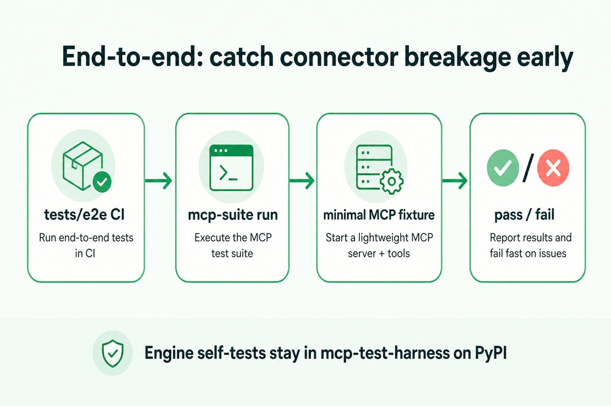

<p align="center">
  
</p>

# MCP Test Suite

> **Multi-language connectors for MCP servers.** One shared `mcp-suite.yaml`. Native adapters for Node, Java, Go, and .NET. Engine from PyPI — never vendored here.

[)](https://pypi.org/project/mcp-test-harness/)
[](LICENSE)
[](https://github.com/vaquarkhan/mcp-test-suite/pkgs/container/mcp-test-suite)
[](docs/DOWNLOADS.md)

## How this relates to mcp-test-harness

| Repo | Role |
|------|------|
| **[mcp-test-harness](https://github.com/vaquarkhan/mcp-test-harness)** | **Main engine** — already on **[PyPI](https://pypi.org/project/mcp-test-harness/)**. Assertions, transports, HTML dashboard, reports. |
| **This repo (`mcp-test-suite`)** | **Connectors only** — declarative YAML, language adapters, Docker, GitHub Action. |

```bash
pip install "mcp-test-harness>=3.0.9"   # engine (PyPI — already live)
```


## Download & install (by language)

Full guide: **[docs/DOWNLOADS.md](docs/DOWNLOADS.md)** · Releases: **[github.com/…/releases](https://github.com/vaquarkhan/mcp-test-suite/releases)**

### 1) Python engine (PyPI — live)

```bash
pip install "mcp-test-harness>=3.0.9"
mcp-test --version
pip install "git+https://github.com/vaquarkhan/mcp-test-suite.git"   # mcp-suite CLI
mcp-suite --version
```

### 2) Java / Kotlin — Maven (GitHub Packages)

```xml
<!-- settings.xml server id=github + PAT with read:packages -->
<repositories>
  <repository>
    <id>github</id>
    <url>https://maven.pkg.github.com/vaquarkhan/mcp-test-suite</url>
  </repository>
</repositories>
<dependency>
  <groupId>io.github.vaquarkhan</groupId>
  <artifactId>mcp-test-suite-junit5</artifactId>
  <version>4.0.0</version>
  <scope>test</scope>
</dependency>
```

Or: download the JAR from [Releases](https://github.com/vaquarkhan/mcp-test-suite/releases) · Tutorial: [docs/tutorials/java.md](docs/tutorials/java.md)

### 3) Node / TypeScript — npm (GitHub Packages)

```ini
# .npmrc
@vaquarkhan:registry=https://npm.pkg.github.com
//npm.pkg.github.com/:_authToken=YOUR_GITHUB_PAT
```

```bash
npm install -D @vaquarkhan/mcp-test-suite-jest
```

Or install the `.tgz` from [Releases](https://github.com/vaquarkhan/mcp-test-suite/releases). Tutorial: [docs/tutorials/typescript.md](docs/tutorials/typescript.md)

### 4) Go — module (live)

```bash
go get github.com/vaquarkhan/mcp-test-suite/adapters/gotest@v4.0.0
```

### 5) .NET — NuGet (GitHub Packages)

```bash
dotnet nuget add source "https://nuget.pkg.github.com/vaquarkhan/index.json" \
  --name github --username USER --password PAT --store-password-in-clear-text
dotnet add package McpTestSuite.Xunit --version 4.0.0
```

### 6) Docker / CI

```bash
docker build -t mcp-test-suite:local .
docker run --rm -v "$PWD":/work -w /work mcp-test-suite:local \
  run --suite mcp-suite.yaml --server-command "node dist/server.js"
```

```yaml
- uses: vaquarkhan/mcp-test-suite@init
  with:
    suite-file: mcp-suite.yaml
    server-command: "node dist/server.js"
```

---

## 60-second start (any language)

```yaml
# mcp-suite.yaml
server:
  command: node dist/server.js   # or java -jar … / go run … / python …
  transport: stdio
cases:
  - name: Echo works
    call: echo
    args: { text: hello }
```

```bash
mcp-suite run --suite mcp-suite.yaml --report-format html --report-output report.html
```

**Same dashboard & reports as Python** — HTML / JUnit / JSON / SARIF are engine features available to every language via `mcp-suite.yaml` (you do not need `test_*.py`).


## Language support

| Language | Download | Tutorial | Examples |
|----------|----------|----------|----------|
| **Any (YAML)** | PyPI engine + `mcp-suite` | [yaml](docs/tutorials/yaml.md) | [declarative/](examples/declarative/) |
| **Python** | `pip install mcp-test-harness` | [python](docs/tutorials/python.md) | [frameworks/python](examples/frameworks/python/) |
| **TypeScript** | `@vaquarkhan/mcp-test-suite-jest` | [typescript](docs/tutorials/typescript.md) | [frameworks/typescript](examples/frameworks/typescript/) |
| **Java / Kotlin** | Maven `mcp-test-suite-junit5` | [java](docs/tutorials/java.md) | [frameworks/java](examples/frameworks/java/) · [kotlin](examples/frameworks/kotlin/) |
| **Go** | `adapters/gotest` module | [go](docs/tutorials/go.md) | [frameworks/go](examples/frameworks/go/) |
| **.NET** | `McpTestSuite.Xunit` | [dotnet](docs/tutorials/dotnet.md) | [frameworks/dotnet](examples/frameworks/dotnet/) |
| **Rust** | YAML + CLI | [rust](docs/tutorials/rust.md) | [frameworks/rust](examples/frameworks/rust/) |


## Cursor IDE

[docs/CURSOR_IDE.md](docs/CURSOR_IDE.md) · [`.cursorrules`](.cursorrules)

## End-to-end confidence

```bash
pip install -e ".[dev]"
python -m pytest tests/ -q   # includes tests/e2e/
```



## Docs map

| Doc | Purpose |
|-----|---------|
| [docs/DOWNLOADS.md](docs/DOWNLOADS.md) | Maven / npm / NuGet / Go / PyPI / Docker |
| [docs/QUICK_START.md](docs/QUICK_START.md) | First green run |
| [docs/tutorials/](docs/tutorials/) | Per-language walkthroughs |
| [docs/MULTI_LANGUAGE.md](docs/MULTI_LANGUAGE.md) | Adoption paths |
| [docs/NO_PYPI_FROM_THIS_REPO.md](docs/NO_PYPI_FROM_THIS_REPO.md) | Engine stays on harness PyPI |

Author: [Vaquar Khan](https://github.com/vaquarkhan) · **License:** [MIT](LICENSE) · **Cite:** [CITATION.cff](CITATION.cff)
