<p align="center">
  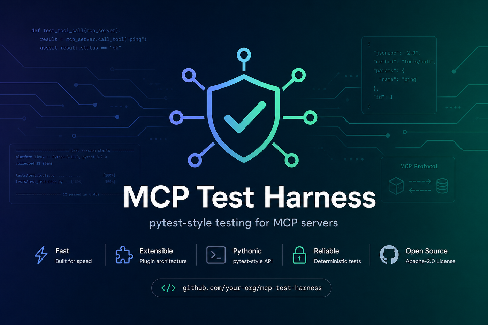
</p>

# MCP Test Suite

> **Multi-language evolution of MCP Test Harness.** One engine. Declarative YAML for every language. Native adapters for Node, Java, Go, and .NET. Universal GitHub Action.

[](https://pypi.org/project/mcp-test-harness/)
[](LICENSE)
[](https://github.com/vaquarkhan/mcp-test-suite/pkgs/container/mcp-test-suite)
[-orange)](docs/DOWNLOADS.md)

## Publish status (why you see 404)

| Artifact | Status | Use today |
|----------|--------|-----------|
| **PyPI** `mcp-test-harness` | **Live** (other repo) | `pip install mcp-test-harness` |
| **Docker** GHCR | **Not published yet** -> 404 is expected | `docker build -t mcp-test-suite:local .` |
| **Maven** `mcp-test-suite-junit5` | **Not published yet** → 404 is expected | Clone + `mvn install` from `adapters/junit5` |
| **npm** `@mcp-test-suite/jest` | **Not published yet** → 404 is expected | Use `adapters/jest` from source |
| **NuGet** `McpTestSuite.Xunit` | **Not published yet** → 404 is expected | Use `adapters/xunit` from source |
| **Go** `adapters/gotest` | **Not published yet** → 404 until repo+tag exist | Use `adapters/gotest` via local `replace` |

Registry URLs in [docs/DOWNLOADS.md](docs/DOWNLOADS.md) are the **target** links after the first publish. They will 404 until you run [docs/PUBLISHING.md](docs/PUBLISHING.md).  
**PyPI is never published from this repo** — [docs/NO_PYPI_FROM_THIS_REPO.md](docs/NO_PYPI_FROM_THIS_REPO.md).

### Use adapters from source (works now)

```bash
# Engine (live)
pip install mcp-test-harness

# Java — install adapter into local ~/.m2
cd adapters/junit5 && mvn -q clean install

# Node — link local package
cd adapters/jest && npm install && npm run build && npm link

# Go — in your go.mod
# replace github.com/vaquarkhan/mcp-test-suite/adapters/gotest => ../mcp-test-suite/adapters/gotest

# .NET — project reference
# <ProjectReference Include="..\mcp-test-suite\adapters\xunit\McpTestSuite.Xunit.csproj" />
```

**After first worldwide publish** — coordinates & links: **[docs/DOWNLOADS.md](docs/DOWNLOADS.md)** · how to publish: **[docs/PUBLISHING.md](docs/PUBLISHING.md)**


**mcp-test-suite** keeps the battle-tested Python engine from **mcp-test-harness** (chaos, schema, JUnit/SARIF, conformance) and removes adoption friction for TypeScript, Java, and Go teams.

| Path | What you use |
|------|----------------|
| **Any language** | `mcp-suite.yaml` + `mcp-test run` (or Docker / standalone binary) |
| **Node / Nest / Express / Fastify** | [`@mcp-test-suite/jest`](adapters/jest/) |
| **Java / Spring Boot / Spring AI / Quarkus / Micronaut** | [`mcp-test-suite-junit5`](adapters/junit5/) |
| **Kotlin** | Same JUnit 5 adapter · [examples/frameworks/kotlin](examples/frameworks/kotlin/) |
| **Go** | [`gotest`](adapters/gotest/) |
| **.NET / ASP.NET** | [`adapters/xunit`](adapters/xunit/) |
| **Python / FastMCP / FastAPI** | Existing `test_*.py` API + YAML |
| **Rust** | YAML + CLI from `cargo test` |
| **Framework packs** | [examples/frameworks/](examples/frameworks/) |
| **CI** | [Universal GitHub Action](action.yml) with language auto-detect |
| **Cursor IDE** | [docs/CURSOR_IDE.md](docs/CURSOR_IDE.md) |

```yaml
# mcp-suite.yaml — shared by every language
cases:
  - name: Validate Weather Tool
    call: weather_api
    args: { city: Chicago }
    assert_schema: WeatherResponse
    max_latency_ms: 200
```

```bash
mcp-test run --suite mcp-suite.yaml --server-command "node build/index.js"
# or after first image publish: docker run --rm -v "$PWD":/work -w /work ghcr.io/vaquarkhan/mcp-test-suite:latest run --suite mcp-suite.yaml ...
```

Deep dive: [docs/MULTI_LANGUAGE.md](docs/MULTI_LANGUAGE.md) · Cursor: [docs/CURSOR_IDE.md](docs/CURSOR_IDE.md) · Examples: [examples/declarative/](examples/declarative/)

---

# MCP Test Harness (core engine)

**Engine today** - install from **[PyPI](https://pypi.org/project/mcp-test-harness/)** (`pip install mcp-test-harness`) or build/use this repo's **OCI image** as **`mcp-test-suite`**. Target GHCR image after first publish: **`ghcr.io/vaquarkhan/mcp-test-suite`**. Until then, build locally: `docker build -t mcp-test-suite:local .` · [docs/DOCKER.md](docs/DOCKER.md) · [docs/RELEASING.md](docs/RELEASING.md)

Author: [Vaquar Khan](https://github.com/vaquarkhan) · **License:** [MIT](LICENSE) ([NOTICE](NOTICE)) · **Cite:** [CITATION.cff](CITATION.cff) · **Sponsors:** [SPONSORS.md](SPONSORS.md)

---

## For C-suite & directors

**What it is:** a CI gate for [MCP](https://modelcontextprotocol.io/) servers - the connectors that let AI agents call tools, data, and APIs. Teams write deterministic tests once; every pull request proves the server still works before it ships.

**Why it matters**

| Business need | What the harness delivers |
|---------------|---------------------------|
| Ship AI features without silent breakage | Automated pass/fail on every PR - no manual Inspector click-through |
| Audit & governance evidence | JUnit / SARIF / HTML reports, conformance badges, security payload packs |
| Lower cost of quality | One tool for functional, regression, performance, and resiliency - not three vendors |
| Trust the gate | **840+** self-tests, **100%** library coverage, and e2e dogfood in CI |

**Not an LLM eval product.** It does not score model answers. It proves *your MCP server* is correct, fast enough, and hardened enough for production. Pair with runtime security ([MCP-Bastion](https://github.com/vaquarkhan/MCP-Bastion)) and IDE config scanning ([mcp-shark](https://github.com/mcp-shark/mcp-shark)). Positioning: [docs/POSITIONING.md](docs/POSITIONING.md) · comparison: [docs/COMPARISON.md](docs/COMPARISON.md).

---

## For architects & tech leads

**Role in the stack:** deterministic, code-first test automation between local MCP Inspector exploration and production. Fits stdio / SSE / HTTP transports; plugs into GitHub Actions (Marketplace Action), JUnit consumers, and Code Scanning (SARIF).

**Architecture (one run)**

```text
mcp-test CLI → config → discover test_*.py → schedule (optional parallel)
  → real MCP session (lifecycle + transport) → assertions → reports
```

| Concern | Approach |
|---------|----------|
| Correctness | Protocol-aware fixtures (`mcp_server`), schema checks, snapshots |
| Performance | `assert_latency` / `assert_throughput` / `assert_stateless_throughput`, baselines, SLO params |
| Security / resiliency | Payload packs, chaos faults, experiment catalog + scorecard (RFC-005) |
| Conformance signal | Levels + README badge via `mcp-test try` / `conformance` (RFC-002); **stateless** via `mcp-test conformance stateless` (RFC-006) |
| Adoption speed | `init`, `generate`, `record` (RFC-001) - live session → suite |
| Extensibility | Plugins (assertions, fixtures, reporters, transports) |

Deep dives: [docs/ARCHITECTURE.md](docs/ARCHITECTURE.md) · [docs/DECISIONS.md](docs/DECISIONS.md) · [docs/ENTERPRISE_GOVERNANCE.md](docs/ENTERPRISE_GOVERNANCE.md) · RFCs under [docs/design/](docs/design/).

---

## For developers

**Fastest path**

```bash
pip install mcp-test-harness
mcp-test init --server-command "python your_server.py"
# edit tests/test_*.py - then:
mcp-test --config mcp-test.yaml
```

Zero-config probe: `mcp-test try --server-command "…"`. CI: Marketplace Action [`mcp-test-harness`](https://github.com/marketplace/actions/mcp-test-harness). Docs hub: [docs/QUICK_START.md](docs/QUICK_START.md) → [docs/DEVELOPER_GUIDE.md](docs/DEVELOPER_GUIDE.md) → [docs/CI_AND_REPORTS.md](docs/CI_AND_REPORTS.md).

MCP Test Harness is a pytest-style framework for MCP servers: the `mcp-test` CLI discovers, runs, and reports tests automatically - replacing much of the manual validation you might do in the MCP Inspector. **Repository:** [github.com/vaquarkhan/mcp-test-harness](https://github.com/vaquarkhan/mcp-test-harness).

> **Documentation:** [QUICK_START](docs/QUICK_START.md) · [DEVELOPER_GUIDE](docs/DEVELOPER_GUIDE.md) · [CI & reports](docs/CI_AND_REPORTS.md) · [performance](docs/PERFORMANCE.md) · [comparison](docs/COMPARISON.md) · [discovery checklist](docs/DISCOVERY.md). **Community:** Issues for bugs; PRs for docs and examples.

---

### What ships end-to-end

Everything below is **implemented, tested, and documented** in this repo (840+ tests, 100% lib coverage gate, e2e dogfood in CI). Version pins live only in [PyPI](https://pypi.org/project/mcp-test-harness/), [CHANGELOG.md](CHANGELOG.md), and install/Docker tags - not in this map.

| Area | Feature | Where to start |
|------|---------|----------------|
| **CLI** | **`mcp-test`** - discover, run, filter (`-k` / `-m`), parallel, watch, reports; subcommands `init`, `try`, `record`, `generate`, `experiment`, `conformance` | [CLI Reference](#cli-reference) · [Quick Start](#quick-start) |
| **Automation** | Scaffold (`init`), zero-config probe (`try`), live **`record`** / **`generate`**, `--watch` re-runs, config-driven CI gates | [Quick Start](#quick-start) · [Core Features](#core-features) |
| **Docker** | OCI image target on **GHCR** (`ghcr.io/vaquarkhan/mcp-test-suite`) - runtime + `:dev`; local [`Dockerfile`](Dockerfile) works now | [Docker](#docker) · [docs/DOCKER.md](docs/DOCKER.md) |
| **Hooks** | **pre-commit** hook (`mcp-test-try`) + example config; plugin / discovery hooks for custom automation | [examples/pre-commit-config.yaml](examples/pre-commit-config.yaml) · [Plugins](#plugins) |
| **Diagnostics** | **MCP trace** - per-test JSON-RPC timeline in HTML/JSON reports; stdio pollution hints | [example_mcp_trace.md](examples/example_mcp_trace.md) |
| **Resiliency** | **Chaos testing** - `@marker(tags=["chaos"], chaos_faults=[...])` (delay, 503, truncate, schema drift) | [example_chaos_testing.md](examples/example_chaos_testing.md) |
| **Resiliency** | **Experiment catalog** - `mcp-test experiment run --suite core` with guardrails and scorecard (RFC-005) | [docs/design/RFC-005-resiliency-experiments.md](docs/design/RFC-005-resiliency-experiments.md) |
| **Conformance** | **Levels + badge** - `mcp-test try` / `conformance badge` (RFC-002); **stateless SEP-2575** via `mcp-test conformance stateless` (RFC-006); README shields.io seal | [docs/design/RFC-002-conformance-levels.md](docs/design/RFC-002-conformance-levels.md) · [RFC-006](docs/design/RFC-006-stateless-mcp.md) |
| **Productivity** | **`mcp-test record`** (RFC-001) + **`generate`** - live calls → suite + snapshots; schema drafts | [RFC-001](docs/design/RFC-001-record-to-suite.md) · [example_generate_scaffold.md](examples/example_generate_scaffold.md) |
| **Marketplace** | GitHub Action with conformance PR outputs | [Marketplace](https://github.com/marketplace/actions/mcp-test-harness) · [example_github_actions.md](examples/example_github_actions.md) |
| **Platform QA** | Tool **coverage map**, **unified portal** in HTML/JSON, **security payload** packs, **resiliency** assertions, **performance baselines**, **`assert_throughput`** / **`assert_stateless_throughput`** SLO params | [docs/POSITIONING.md](docs/POSITIONING.md) · [docs/SECURITY_TESTING.md](docs/SECURITY_TESTING.md) · [RFC-006](docs/design/RFC-006-stateless-mcp.md) |
| **CI / security** | **SARIF** export, OWASP MCP rule metadata, **PR summary** markdown + GitHub Action `pr-comment` | [docs/CI_AND_REPORTS.md](docs/CI_AND_REPORTS.md) |
| **Self-test** | **E2E dogfood** - pytest spawns real `mcp-test` CLI against bundled FastMCP fixtures; **100% coverage** enforced on every PR | [We eat our own dogfood](#we-eat-our-own-dogfood) |
| **Examples** | Runnable **platform-qa** demo pack (trace + chaos + generate) | [feature-demo/platform-qa](examples/feature-demo/platform-qa/README.md) |
| **Website** | Marketing site at [vaquarkhan.github.io/mcp-test-harness](https://vaquarkhan.github.io/mcp-test-harness/) (deploys `html/` via GitHub Actions) | [html/index.html](html/index.html) |

Full history: [CHANGELOG.md](CHANGELOG.md) · roadmap: [docs/ROADMAP.md](docs/ROADMAP.md).

---

## Visual guide

<p align="center">
  
</p>

<p align="center"><em>One command from your repo to a gated MCP test run - local or in CI.</em></p>

<table>
<tr>
<td width="50%" valign="top">

**Developer journey**

<p align="center">
  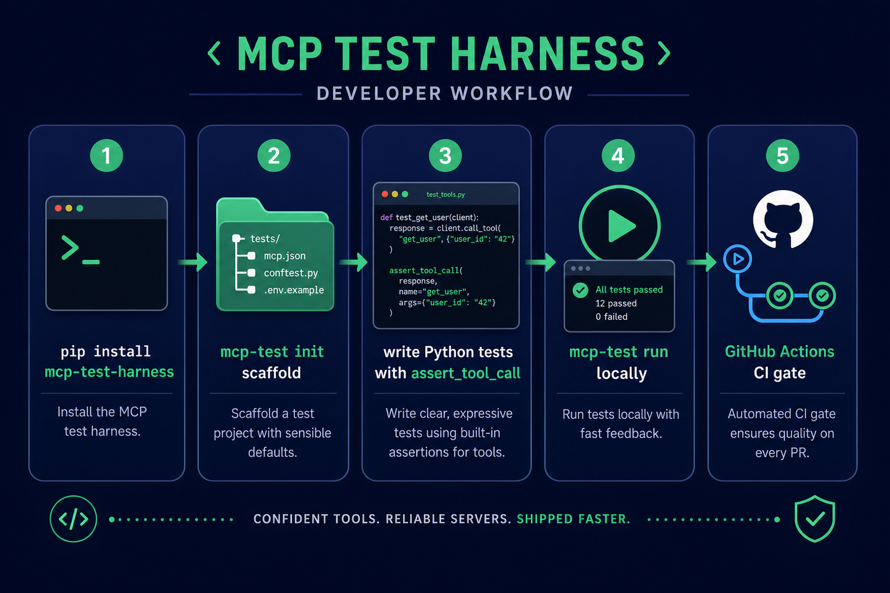
</p>

`pip install` → `mcp-test init` → write `test_*.py` → `mcp-test` → merge with confidence.

</td>
<td width="50%" valign="top">

**Three testing modes**

<p align="center">
  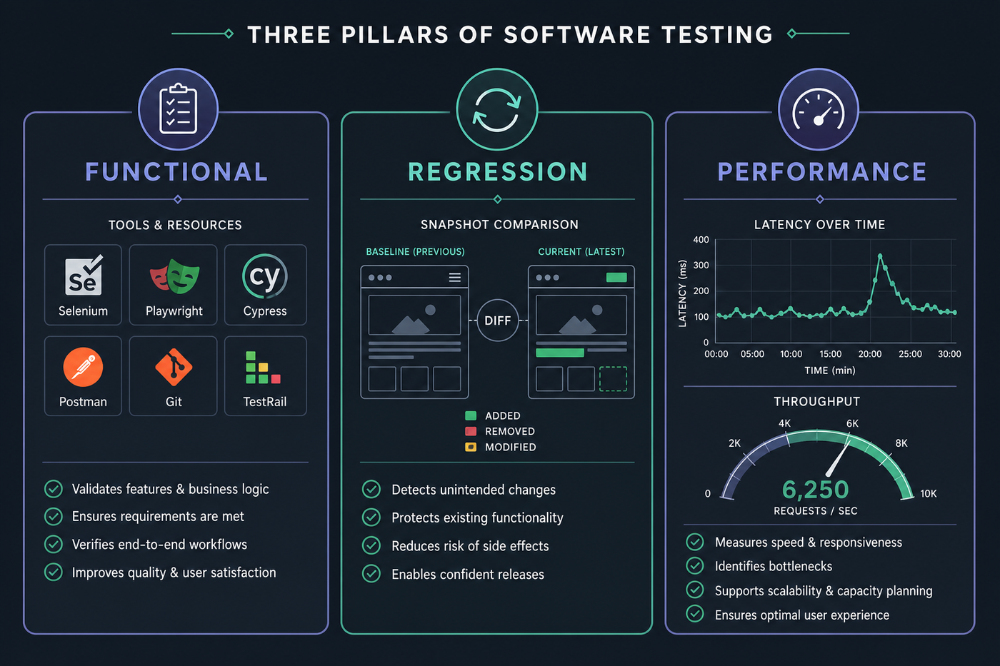
</p>

Functional correctness, snapshot regression, and SLO-style performance - not three separate tools.

</td>
</tr>
</table>

<p align="center">
  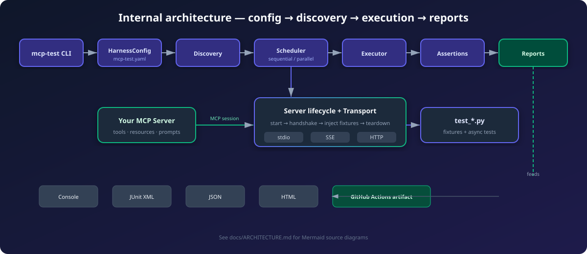
</p>

<p align="center"><em>Under the hood: config → discovery → scheduling → real MCP sessions → deterministic assertions → multi-format reports.</em></p>

### All visual assets

Every diagram lives in [`docs/images/`](docs/images/). Quick reference:

| Image | What it shows |
|-------|----------------|
| [`hero-banner.png`](docs/images/hero-banner.png) | Project hero - pytest-style MCP testing |
| [`end-to-end-flow.png`](docs/images/end-to-end-flow.png) | Full pipeline: CLI → server → assertions → reports |
| [`developer-journey.png`](docs/images/developer-journey.png) | Install → init → write tests → run → CI |
| [`three-testing-modes.png`](docs/images/three-testing-modes.png) | Functional, regression, and performance pillars |
| [`architecture-flow.svg`](docs/images/architecture-flow.svg) | Internal modules and data path (vector) |
| [`stateless-dual-mode.svg`](docs/images/stateless-dual-mode.svg) | **Dual mode:** stateful session vs stateless HTTP (SEP-2575 / RFC-006) |
| [`mcp-testobarness-feature.png`](docs/images/mcp-testobarness-feature.png) | Core feature map |
| [`assertions-grid.png`](docs/images/assertions-grid.png) | Assertion library at a glance |
| [`report-formats.png`](docs/images/report-formats.png) | Console, JUnit, JSON, and HTML format overview (infographic) |
| [`html-dashboard.png`](docs/images/html-dashboard.png) | **Live HTML dashboard** - format previews (click to expand), stat cards, charts, filters, PDF/CSV export |
| [`transport-options.png`](docs/images/transport-options.png) | stdio, SSE, and HTTP transports |
| [`parallel-execution.png`](docs/images/parallel-execution.png) | Multi-worker scheduling and module grouping |
| [`ci-pipeline.png`](docs/images/ci-pipeline.png) | GitHub Actions PR gate workflow |
| [`docker-distribution.png`](docs/images/docker-distribution.png) | PyPI, GHCR container, and standalone binary |
| [`ecosystem-map.png`](docs/images/ecosystem-map.png) | Position vs Inspector, conformance, evals, Bastion |
| [`harness-bastion-pairing.png`](docs/images/harness-bastion-pairing.png) | Test in CI, secure in production |
| [`testherness.png`](docs/images/testherness.png) | Quick-start overview |
| [`dogfood-e2e.svg`](docs/images/dogfood-e2e.svg) | **Dogfood:** pytest runs `mcp-test` against bundled MCP fixtures (840+ tests, 100% lib coverage) |

---

## We eat our own dogfood

A test harness should prove itself. This repo runs **840+ pytest cases** with a **100% line coverage gate** on `src/mcp_test_harness`, plus **end-to-end dogfood** tests that spawn the real `mcp-test` CLI against a bundled FastMCP server:

<p align="center">
  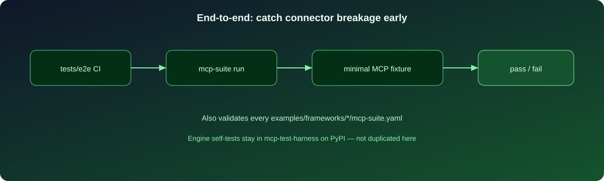
</p>

```bash
# Same gate CI enforces on every PR
coverage run -m pytest tests/ --ignore=tests/test_workspace.py -q
coverage report --fail-under=100

# E2E dogfood only
python -m pytest tests/test_harness_dogfood_e2e.py -m e2e -v
```

Fixtures live under [`tests/fixtures/`](tests/fixtures/) (`minimal_mcp_server.py`, `harness_self_test/`). See [docs/DEVELOPER.md](docs/DEVELOPER.md#end-to-end-dogfood) and [CONTRIBUTING.md](CONTRIBUTING.md#develop--test).

---

## Why teams adopt this

<p align="center">
  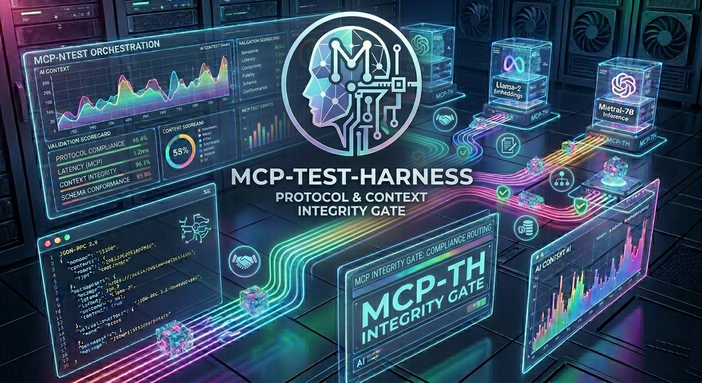
</p>

MCP Test Harness is the **deterministic, CI-native gate** for MCP servers - one run proves correctness, speed, and security baselines without an LLM in the loop. Full positioning: **[docs/POSITIONING.md](docs/POSITIONING.md)**.

### Four differentiators

| # | Differentiator | What you get |
|---|----------------|--------------|
| **1** | **Tri-modal CI architecture** | Functional + regression + performance in one `mcp-test` run - `assert_latency` (p95/p99 + warmup), `assert_throughput` (`min_rps`, `max_p99_ms`, `max_error_rate`), `assert_tool_idempotent`, JSON **performance baselines** |
| **2** | **Protocol-aware fixtures** | `mcp_server` / `mcp_server_session` - spawn, handshake, inject session, teardown; parallel module grouping |
| **3** | **Code-first workflows** | Multi-step agent flows in async Python (anti-DSL); `@marker(tags=[...])` for smoke/security/perf |
| **4** | **Unified portal** | One HTML/JSON artifact: category scores, **tool coverage map** (advertised vs tested vs missing auth), security/resiliency packs |

### Three testing modes in one tool

- **Functional:** `assert_tool_call`, `assert_resource_read`, schema validation
- **Regression:** `assert_snapshot`, `assert_tool_idempotent`
- **Performance:** `assert_latency`, `assert_throughput`, `assert_latency_within_baseline`

Pair with **[mcp-shark](https://github.com/mcp-shark/mcp-shark)** for IDE config security and **[MCP-Bastion](https://github.com/vaquarkhan/MCP-Bastion)** for runtime protection - see [docs/COMPARISON.md](docs/COMPARISON.md).

MCP Test Harness supports **Responsible AI** and governance programs: schema contract checks, security payload packs (`@marker(tags=["security"])`), coverage gaps in reports, and EU AI Act demo packs.

## Documentation

**Hub (table of all guides + suggested reading order):** [docs/README.md](docs/README.md)

| Document | Contents |
|----------|----------|
| [docs/QUICK_START.md](docs/QUICK_START.md) | **Fastest path** - install, `mcp-test init`, run |
| [docs/DEVELOPER_GUIDE.md](docs/DEVELOPER_GUIDE.md) | **Canonical reference** - setup, config, stdio/parallel/validation, assertions, reporting |
| [docs/CI_AND_REPORTS.md](docs/CI_AND_REPORTS.md) | **CI, JUnit, JSON, HTML** - do you need to *publish* test reports? (usually: no) |
| [docs/POSITIONING.md](docs/POSITIONING.md) | **Why we're different** - four differentiators, enterprise governance, mcp-shark pairing |
| [docs/PERFORMANCE_TESTING_STRATEGY.md](docs/PERFORMANCE_TESTING_STRATEGY.md) | **Product pitch** - why MCP performance testing belongs in the harness; roadmap and scope |
| [docs/ROADMAP.md](docs/ROADMAP.md) | **Roadmap** - now/next/later plan plus **prioritized value bets** (unified reports, security packs, resiliency, coverage map, SLO load testing) |
| [docs/SECURITY_TESTING.md](docs/SECURITY_TESTING.md) | **Security testing** - MCP-aware security assertions and CI guidance |
| [docs/CONTRACT_AND_COMPAT.md](docs/CONTRACT_AND_COMPAT.md) | **Contracts & compatibility** - drift protection and protocol/client matrix strategy |
| [docs/ENTERPRISE_GOVERNANCE.md](docs/ENTERPRISE_GOVERNANCE.md) | **Enterprise** - audit/policy/tenant governance guidance (including EU AI Act evidence mapping notes) |
| [docs/PLUGIN_REGISTRY.md](docs/PLUGIN_REGISTRY.md) | **Plugin registry** - extension catalog and integration categories |
| [docs/TUTORIAL.md](docs/TUTORIAL.md) | Step-by-step tutorial |
| [docs/DECISIONS.md](docs/DECISIONS.md) | Architecture and product decisions |
| [docs/IMPLEMENTATION_CHECKLIST.md](docs/IMPLEMENTATION_CHECKLIST.md) | Maintainer: features vs. code locations |
| [docs/COMPARISON.md](docs/COMPARISON.md) | **Ecosystem** - where this harness fits alongside conformance/eval/benchmark categories |
| [docs/LLM_TEST_GENERATION.md](docs/LLM_TEST_GENERATION.md) | **LLM + tests** - draft-with-review: good; **auto** trusted in CI: bad fit for this harness |
| [docs/COLLECTIONS.md](docs/COLLECTIONS.md) | **Postman / Newman-style** multi-step flows, “environments”, and roadmap (declarative collections not in core yet) |
| [docs/DISCOVERY.md](docs/DISCOVERY.md) | **Registries and promotion** - internal checklist (PyPI, [server.json](server.json), awesome lists) |
| [docs/DOCKER.md](docs/DOCKER.md) | **Docker & OCI** - PyPI, **GHCR** / **GitHub Packages** links, build targets, `docker run` |
| [docs/RELEASING.md](docs/RELEASING.md) | **Ship `v*`** - PyPI trusted publishing + GHCR images in one tag |
| [docs/ARCHITECTURE.md](docs/ARCHITECTURE.md) | **Mermaid** diagrams: CLI → scheduler → lifecycle → session → tests |
| [docs/EDITORS.md](docs/EDITORS.md) | **Visual Studio Code & Cursor** - snippets, Mermaid preview, recommended extensions |
| [docs/MARKDOWN_CONVENTIONS.md](docs/MARKDOWN_CONVENTIONS.md) | **Markdown** - `[!TIP]` / `**Feature**` callouts and fenced code for readable docs |
| [CHANGELOG.md](CHANGELOG.md) | **Release history** (Keep a Changelog) |
| [CONTRIBUTING.md](CONTRIBUTING.md) | **How to contribute** (tests, coverage, release bumps) |
| [CITATION.cff](CITATION.cff) | **Optional citation** - machine-readable metadata (not required by the license) |
| [Dockerfile](Dockerfile) (and [`.dockerignore`](.dockerignore)) | **Container image** for `mcp-test` - see [Docker](#docker) |

For production security (prompt injection defense, PII redaction, rate limiting, RBAC), see [MCP-Bastion](https://github.com/vaquarkhan/MCP-Bastion) - the companion **security** middleware; this repo is for **test automation**.

## Core Features

<p align="center">
  
</p>

| Feature | Description |
|---------|-------------|
| Test discovery | Finds `test_*.py` files and `test_` functions automatically (pytest conventions); broken files log a warning with path and exception |
| MCP assertions | `assert_tool_call`, `assert_resource_read`, `assert_prompt`, `assert_capabilities`, `assert_snapshot`, plus `assert_tool_schema`, `assert_protocol_version`, `assert_tool_idempotent`, **`assert_latency`** (p95/p99/mean + **warmup**), **`assert_throughput`** (concurrent load + **`min_rps`**, **`max_p99_ms`**, **`max_error_rate`**), **`assert_latency_within_baseline`**, **security payload packs** - see [docs/PERFORMANCE.md](docs/PERFORMANCE.md), [docs/SECURITY_TESTING.md](docs/SECURITY_TESTING.md) |
| Fixture system | Built-in `mcp_server` / `mcp_server_session`, custom fixtures; **cycle detection** for dependency errors |
| Schema validation | JSON-RPC envelope checks; with `schema_validation: true` (default), post-connect checks on `initialize`, `tools/list` (+ tool `inputSchema`), `resources` / `prompts` list shapes, and a best-effort `call_tool` probe to validate `content` item shapes |
| Snapshot testing | Compare responses; `ignore_fields` and `mask_patterns` for unstable data |
| Parallel execution | Multiple workers; **tests from the same file stay on one worker** so per-module fixtures remain correct |
| Watch mode | `mcp-test --watch` re-runs when test `*.py` files change (configurable poll interval; debounce coalesces rapid saves) |
| Markers | `@marker(timeout=60, retry=3, tags=["smoke"])` and `@skip(reason="...")` |
| Reports | Console summary, JUnit XML (GitHub Actions/Jenkins/GitLab), JSON/HTML with **MCP trace timelines**, **unified portal** / coverage map, **SARIF** for Code Scanning, **HTML dashboard** with PDF/CSV export and live filters |
| Plugin system | Extend with custom assertions, fixtures, reporters, and transport adapters |
| Transport support | stdio, SSE, streamable HTTP -- test local and remote servers |
| GitHub Action | One-line CI integration with artifact upload |
| **Docker** | Target image **`ghcr.io/vaquarkhan/mcp-test-suite`** (`:latest` / version tags + `:dev`) after first publish; local [`Dockerfile`](Dockerfile) with `mcp-test` (runtime) or `pytest` + dev extras via `--target dev` works now |
| Standalone binary | Single binary via PyInstaller, no Python required on target |
| **MCP trace** | Per-test JSON-RPC event log + interactive HTML timeline - [example_mcp_trace.md](examples/example_mcp_trace.md) |
| **Chaos testing** | `@marker(tags=["chaos"], chaos_faults=[...])` - delay, 503, truncate, schema drift - [example_chaos_testing.md](examples/example_chaos_testing.md) |
| **`mcp-test generate`** | Draft tests from live `tools/list` + optional drift report - [example_generate_scaffold.md](examples/example_generate_scaffold.md) |

**Beginner demo packs by testing type:** [functional-testing](examples/feature-demo/functional-testing/README.md) · [regression-testing](examples/feature-demo/regression-testing/README.md) · [performance-testing](examples/feature-demo/performance-testing/README.md) (each includes runnable tests plus JSON/JUnit/HTML report config).  
**Platform QA (trace + chaos + generate):** [platform-qa](examples/feature-demo/platform-qa/README.md)  
**Full scenario index:** [examples/feature-demo/README.md](examples/feature-demo/README.md)

## Ecosystem (Conformance, evals, benchmarks)

<p align="center">
  
</p>

MCP Test Harness is **deterministic** (your tests call the protocol directly; no LLM required). The wider MCP space includes **protocol conformance** suites, **agent/LLM** evaluation frameworks, and **model** benchmarks. A concise map of tools, when to use each, and how they **complement** (not replace) the harness is in **[docs/COMPARISON.md](docs/COMPARISON.md)**.

## Installation

<p align="center">
  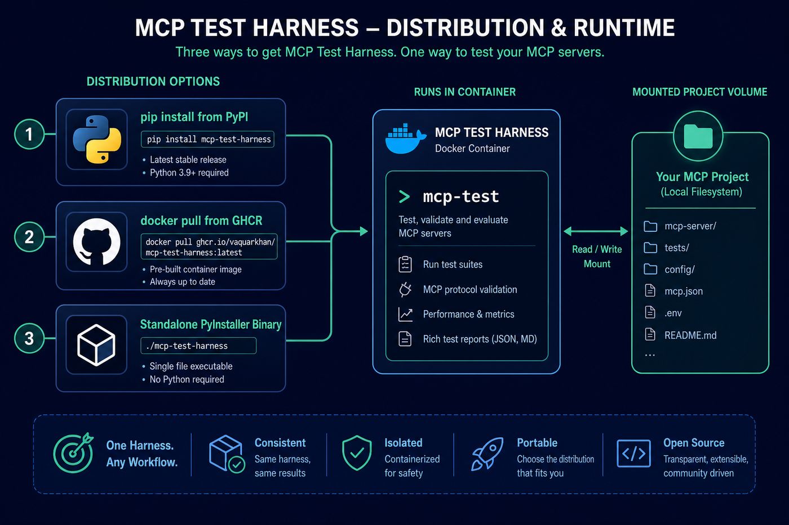
</p>

**Current stable version:** **3.0.9** (see [CHANGELOG.md](CHANGELOG.md)). Core harness (lightweight: `mcp` + YAML + anyio; **no** MCP-Bastion / Presidio stack):

```bash
pip install mcp-test-harness
# pin, if you need a fixed version:
# pip install mcp-test-harness==3.0.9
```

**Container path (no local Python):** after first image publish use `docker pull ghcr.io/vaquarkhan/mcp-test-suite:4.0.0` or `:latest`; today build locally from this repo - see the [image](#docker) section for `docker run` and dev tags.

**Optional** [mcplint](src/mcplint/) / MCP-Bastion pin helpers (transitive set can be **large**; same as a full Bastion install):

```bash
pip install mcp-test-harness[mcplint]
# or the historical PyPI name for the monorepo shim:
pip install mcplint
```

Or from source:

```bash
git clone https://github.com/vaquarkhan/mcp-test-harness.git
cd mcp-test-harness
python -m venv .venv && source .venv/bin/activate  # or .venv\Scripts\activate on Windows
pip install -e ".[dev]"
mcp-test --version
```

### Docker

<p align="center">
  
</p>

**One-page guide (PyPI, container registries, Mermaid build diagram, `docker run` copy-paste):** [docs/DOCKER.md](docs/DOCKER.md) · **System diagram (flow + sequence):** [docs/ARCHITECTURE.md](docs/ARCHITECTURE.md) · **Visual Studio Code & Cursor (snippets, Mermaid, extensions):** [docs/EDITORS.md](docs/EDITORS.md)

Pre-built **runtime** and **dev** (test tooling) images are defined in the repo [`Dockerfile`](Dockerfile) (and [`.dockerignore`](.dockerignore) keeps the build context small). Each **`v*`** git tag can push **`ghcr.io/vaquarkhan/mcp-test-suite`**: e.g. **`:4.0.0`**, **`:latest`**, **`:4.0.0-dev`**, **`:dev`**. Until the first publish, use `docker build -t mcp-test-suite:local .`. [docs/RELEASING.md](docs/RELEASING.md) · [docs/DOCKER.md](docs/DOCKER.md).

| Build | Description |
|-------|-------------|
| **Default (runtime)** | `mcp-test` and core dependencies only - smallest image. |
| **`--target dev`** | Adds the same optional packages as `pip install -e ".[dev]"` (e.g. **pytest**, **jsonschema**, **PyInstaller**). Use this when you want to run the project’s `tests/` inside a container. |

**Build the default image** (from the repository root; requires [Docker](https://docs.docker.com/get-docker/)):

```bash
docker build -t mcp-test-suite:local .
```

**Smoke the CLI** (the image entrypoint is `mcp-test`):

```bash
docker run --rm mcp-test-suite:local --version
```

**Run `mcp-test` against a project** mounted into the working directory (paths below use POSIX shells; on Windows, use PowerShell and replace `$PWD` with your project path, e.g. ``${PWD}`` in Git Bash, or the full `C:\...` form):

```bash
docker run --rm -v "$PWD":/work -w /work mcp-test-suite:local
```

The default command shows `mcp-test --help`. Pass the same arguments you use locally, for example `docker run --rm -v "$PWD":/work -w /work mcp-test-suite:local .` to discover and run tests in the current config.

**Build the dev image and run the test suite** (requires your test tree mounted into `/work`):

```bash
docker build -t mcp-test-suite:dev --target dev .
docker run --rm -v "$PWD":/work -w /work --entrypoint pytest mcp-test-suite:dev tests/ -q
```

For coverage as in [pyproject.toml](pyproject.toml), you can add `--cov=src/mcp_test_harness` if your `tests/` and config are on the mount.

**Windows (PowerShell)**, using Docker Desktop, mount the current directory, for example:

```powershell
docker run --rm -v "${PWD}:/work" -w /work mcp-test-suite:local
```

**Size and first-build time** depend on what you install: the default **runtime** image matches `mcp-bastion-python`-free core dependencies. If you add **`[dev]`**, **`[mcplint]`**, or `pip install mcp-bastion-python` in the same environment, the resolver may pull a **large** transitive set (e.g. Presidio / NLP and, on many Linux x86_64 wheels, very large ML/CUDA-related packages). The first `docker build` with those extras can take a long time and produce a **multi-gigabyte** image. That is expected for a full install of the Bastion tree, not a bug in the `Dockerfile` when you opt into that stack.

> **Note:** The Docker image is optional; many teams use `pip install` in CI. Use the image when you need a **reproducible, Python-isolated** environment without a local venv, or a **portable** `mcp-test` in pipelines that standardize on containers.

## Quick Start

<p align="center">
  
</p>

### 0. Scaffold a starter (optional)

With `mcp-test` on your `PATH` (after `pip install`):

```bash
mcp-test init
```

This writes `tests/test_mcp_server_example.py` and a minimal `mcp-test.yaml`. Set your real launch command, for example:

```bash
mcp-test init --server-command "python -m your_package.mcp"
```

Options: `mcp-test init --help` (custom `--dir`, `--filename`, `--no-config`, `--force`).

**Check the server first (no tests):** `mcp-test doctor` uses the same `mcp-test.yaml` (or `--server-command`) to start the server, run the MCP handshake, print the protocol version, list tools / resources / prompts, and optionally run the same post-connect schema checks as a normal run. Exits `0` when healthy, `1` on startup or schema errors. See `mcp-test doctor --help`.

**Editor snippets:** the repo includes [`.vscode/mcp-test-harness.code-snippets`](.vscode/mcp-test-harness.code-snippets) - in VS Code or Cursor, type prefixes like `mcp-assert-tool` or `mcp-test-async` in a `*.py` file to insert common patterns.

### 1. Write a test

Create `tests/test_my_server.py`:

```python
from mcp_test_harness import assert_tool_call, assert_capabilities

async def test_server_has_tools(mcp_server):
    """Verify the server advertises tool capabilities."""
    await assert_capabilities(mcp_server, {"tools": {}})

async def test_echo_tool(mcp_server):
    """Call the echo tool and check it works."""
    result = await assert_tool_call(mcp_server, "echo", {"message": "hello"})
    assert result is not None
```

The `mcp_server` parameter is a built-in fixture. The harness automatically starts your server, connects via MCP, performs the initialize handshake, and injects a ready-to-use session.

### 2. Run it

```bash
mcp-test --server-command "python my_server.py" tests/
```

Output:

```
  [PASS] test_server_has_tools (45.2ms)
  [PASS] test_echo_tool (120.8ms)

2 passed, 0 failed, 0 errored, 0 skipped
Total time: 312.5ms
```

### 3. Add a config file

Create `mcp-test.yaml`:

```yaml
server:
  command: python my_server.py
  transport: stdio

test:
  dirs: [tests/]
  timeout: 30

report:
  format: junit
  output: reports/results.xml
```

Then just: `mcp-test`

## Assertion Reference

<p align="center">
  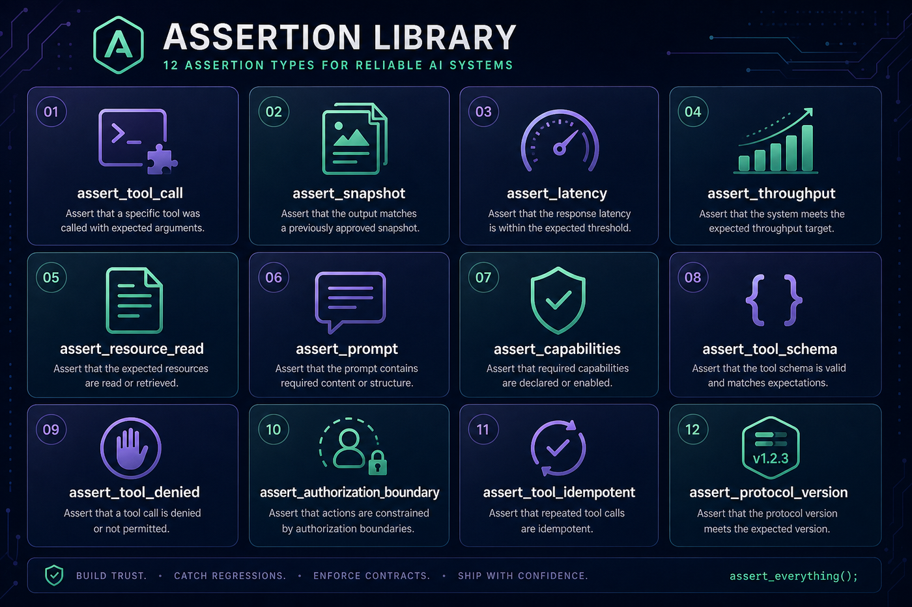
</p>

### assert_tool_call -- invoke a tool and validate the response

```python
# Basic: fail if the tool returns an error
await assert_tool_call(mcp_server, "echo", {"message": "hello"})

# With expected output
await assert_tool_call(mcp_server, "add", {"a": 1, "b": 2},
    expected=[{"text": "3", "isError": False}])

# Validate arguments against the tool’s inputSchema (requires `jsonschema`)
await assert_tool_call(
    mcp_server, "add", {"a": 1, "b": 2},
    validate_against_input_schema=True,
)

# Use the return value
result = await assert_tool_call(mcp_server, "get_data", {})
assert len(result.content) > 0
```

Other helpers: `assert_tool_schema`, `assert_protocol_version`, `assert_tool_idempotent`, `assert_latency`, `assert_tool_call_validates_input`, `assert_tool_denied`, `assert_authorization_boundary` - see **Part 3b** in the [Developer Guide](docs/DEVELOPER_GUIDE.md).

### assert_resource_read -- read a resource and check content/MIME type

```python
await assert_resource_read(mcp_server, "file:///config.json",
    expected_content='{"debug": true}',
    expected_mime_type="application/json")
```

### assert_prompt -- get a prompt and validate messages

```python
await assert_prompt(mcp_server, "summarize",
    arguments={"text": "The quick brown fox."},
    expected_messages=[{"role": "assistant", "content": "Summary: A fox."}])
```

### assert_capabilities -- verify server capabilities

```python
await assert_capabilities(mcp_server, {"tools": {}, "resources": {}})
```

### assert_snapshot -- regression detection via stored snapshots

```python
from pathlib import Path
from mcp_test_harness import assert_snapshot

async def test_stable_output(mcp_server):
    result = await mcp_server.call_tool("generate_report", {})
    await assert_snapshot(result, "report_output", test_file=Path(__file__))

# Drop volatile fields or mask dynamic strings (regex patterns)
async def test_noisy_output(mcp_server):
    result = await mcp_server.call_tool("with_ids", {})
    await assert_snapshot(
        result,
        "noisy",
        test_file=Path(__file__),
        ignore_fields=["requestId", "timestamp"],
        mask_patterns=[r"req_[a-f0-9]+"],
    )
```

First run creates the snapshot. Later runs compare against it. Update with `mcp-test --update-snapshots`.

All assertions produce diff output on failure:

```
  [FAIL] test_echo (18.5ms)
      Tool 'echo' response mismatch
      --- expected
      +++ actual
      @@ -1,3 +1,3 @@
       [
      -  {"text": "hello", "isError": false}
      +  {"text": "HELLO", "isError": false}
       ]
```

## Fixtures

Built-in fixtures:

| Fixture | Scope | Description |
|---------|-------|-------------|
| `mcp_server` | Per-test | Fresh MCP session for each test |
| `mcp_server_session` | Per-module | Shared session across all tests in a file |

Custom fixtures:

```python
from mcp_test_harness.fixtures import fixture, FixtureScope

@fixture
async def api_key():
    return "test-key-12345"

@fixture
async def database():
    db = await connect()
    yield db              # test runs here
    await db.close()      # teardown

@fixture(scope=FixtureScope.PER_MODULE)
async def shared_client():
    client = await create_client()
    yield client
    await client.close()

# Injected by parameter name
async def test_query(mcp_server, database, api_key):
    result = await mcp_server.call_tool("query", {"db": database.url, "key": api_key})
```

## Markers

```python
from mcp_test_harness import marker, skip

@marker(timeout=120)                    # custom timeout
@marker(retry=3)                        # retry on failure
@marker(tags=["smoke", "critical"])     # tags for filtering
@marker(timeout=60, retry=2, tags=["integration"])  # combine

@skip                                   # skip unconditionally
@skip(reason="Bug #42")                # skip with reason
```

Filter from CLI:

```bash
mcp-test -m smoke           # run only smoke-tagged tests
mcp-test -k "test_echo"     # run tests matching name
mcp-test -k "*workflow*"    # glob patterns
```

## Reports

<p align="center">
  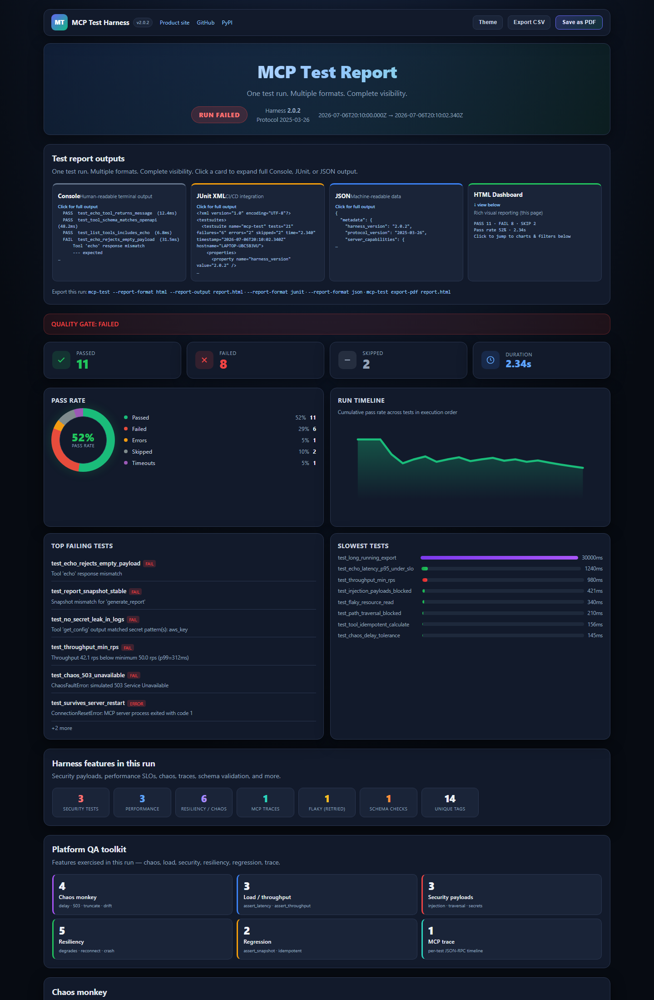
</p>
<p align="center"><em>Self-contained HTML report from a real sample run (21 tests). <a href="https://vaquarkhan.github.io/mcp-test-harness/reports/sample_mcp_test_report.html">Open interactive sample</a>.</em></p>

<p align="center">
  
</p>

```bash
# JUnit XML for CI (GitHub Actions, Jenkins, GitLab)
mcp-test --report-format junit --report-output results.xml

# JSON with full metadata (server capabilities, retry history, schema violations)
mcp-test --report-format json --report-output results.json

# HTML dashboard (self-contained - charts, filters, PDF export)
mcp-test --report-format html --report-output reports/run.html

# Optional PDF summary (JMeter-style; requires Chrome/Edge)
mcp-test --report-format html --report-output reports/run.html --pdf-output reports/run.pdf
mcp-test export-pdf reports/run.html -o reports/run.pdf
```

**HTML dashboard:** live format previews (click Console/JUnit/JSON to expand full output), stat cards, pass-rate donut, chaos/load/security panels, date & duration filters, light/dark theme, Export CSV of filtered rows, Save as PDF, keyboard shortcuts (`/` search, `Esc` clear, `t` theme, `?` help).

**Live sample:** [sample HTML report](https://vaquarkhan.github.io/mcp-test-harness/reports/sample_mcp_test_report.html)

Console output is always printed:

```
  [PASS] test_echo (45.2ms)
  [FAIL] test_divide (18.5ms)
      Division by zero
  [SKIP] test_future (0.0ms)

2 passed, 1 failed, 0 errored, 1 skipped
Total time: 200.0ms
```

## Parallel Execution

<p align="center">
  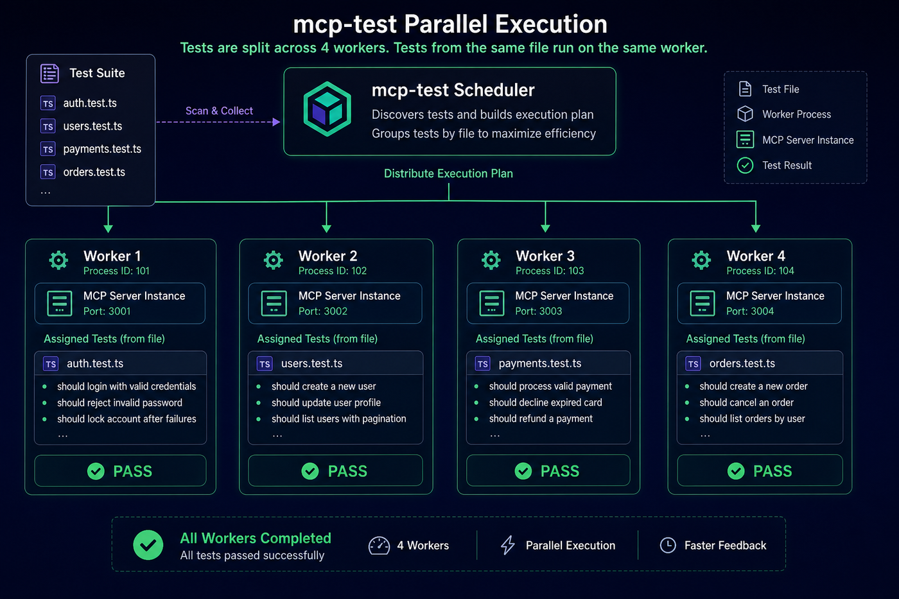
</p>

```bash
mcp-test --parallel              # use all CPU cores
mcp-test --parallel --workers 4  # specify worker count
```

Each worker gets its own server instance. If one crashes, others continue.

**Module grouping:** tests from the same file are always scheduled on the **same** worker, so per-module fixtures (`mcp_server_session`, etc.) stay valid. Do not rely on test order *across* different files in parallel mode.

## Transport Support

<p align="center">
  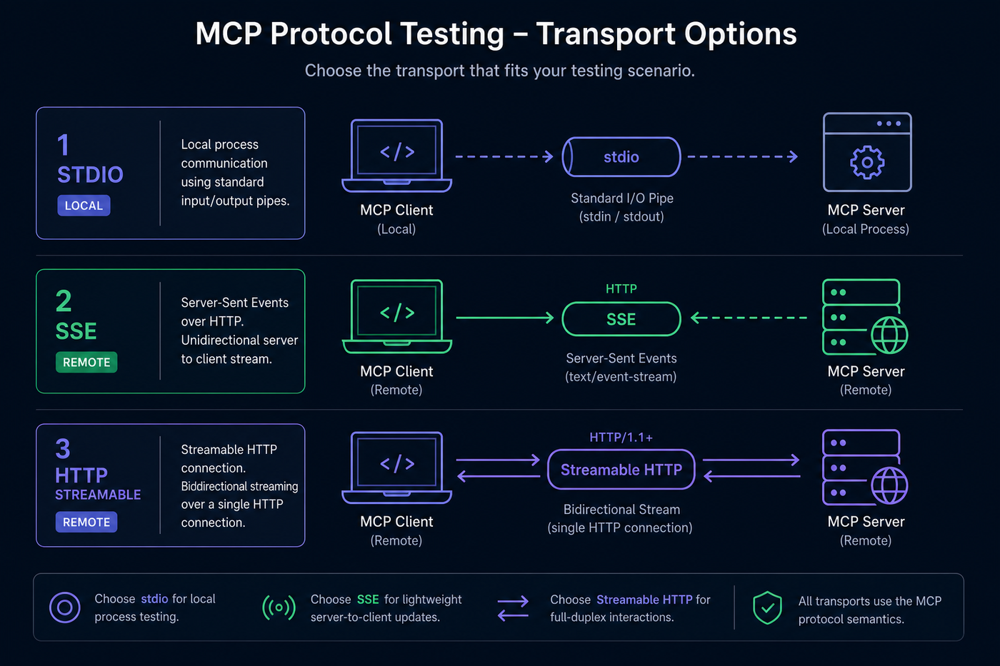
</p>

| Transport | Use case | Example |
|-----------|----------|---------|
| stdio | Local servers (default) | `--server-command "python server.py"` |
| SSE | Remote servers via Server-Sent Events | `--transport sse --server-command "http://localhost:8080/sse"` |
| HTTP | Remote servers via streamable HTTP | `--transport http --server-command "http://localhost:8080/mcp"` |

With authentication:

```yaml
server:
  command: http://your-server.example.com/mcp
  transport: http
  transport_options:
    headers:
      Authorization: "Bearer your-token"
```

## GitHub Action

<p align="center">
  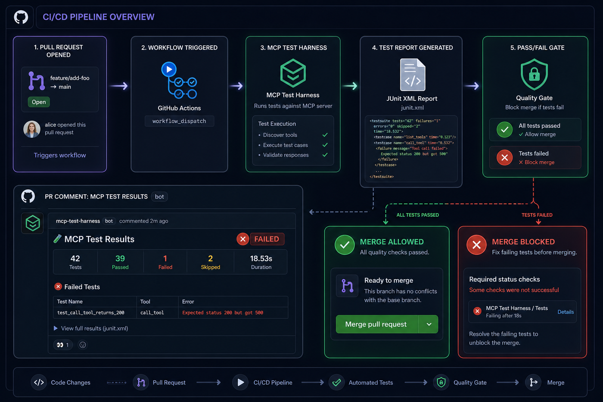
</p>

```yaml
# .github/workflows/mcp-tests.yml
name: MCP Server Tests
on: [push, pull_request]

jobs:
  test:
    runs-on: ubuntu-latest
    steps:
      - uses: actions/checkout@v4
      - name: Test MCP Server
        id: mcp
        uses: vaquarkhan/mcp-test-harness@v3.0.9
        with:
          server-command: "python my_server.py"
          test-directory: "tests/"
          pr-comment: "true"
      - run: echo "Conformance ${{ steps.mcp.outputs.conformance-level }}"
```

Zero-config probe (no suite yet):

```yaml
- uses: vaquarkhan/mcp-test-harness@v3.0.9
  with:
    try-mode: "true"
    server-command: "uvx awslabs.roda-mcp-server@latest"
```

| Input | Default | Description |
|-------|---------|-------------|
| `server-command` | `""` | Command to start the server |
| `transport` | `stdio` | stdio, sse, or http |
| `test-directory` | `tests/` | Path to test files |
| `config-file` | `""` | Path to config file |
| `report-format` | `json` | Always writes JSON for conformance extraction |
| `harness-version` | `latest` | Version to install |
| `pr-comment` | `false` | Post PR summary with conformance level |
| `try-mode` | `false` | Run `mcp-test try` instead of a suite |
| `try-suite` | `""` | Optional experiment suite when `try-mode` is true |

| Output | Description |
|--------|-------------|
| `test-result` | `pass` or `fail` |
| `conformance-level` | RFC-002 level name (Boot … Resilient) |
| `conformance-level-num` | Numeric level (-1 to 4) |

Marketplace: [mcp-test-harness](https://github.com/marketplace/actions/mcp-test-harness). Path form: `vaquarkhan/mcp-test-harness/.github/actions/mcp-test@v3.0.9` - see [examples/example_github_actions.md](examples/example_github_actions.md).

## Plugins

Extend MCP Test Harness with custom assertions, fixtures, reporters, and transports:

```python
from mcp_test_harness.plugins import PluginContext
from mcp_test_harness.fixtures import FixtureScope

class MyPlugin:
    name = "my-plugin"

    def register(self, context: PluginContext) -> None:
        context.add_assertion("assert_latency", check_latency)
        context.add_fixture("db", db_factory, FixtureScope.PER_MODULE)
        context.add_reporter("markdown", MarkdownReporter())

plugin = MyPlugin()
```

Load via config:

```yaml
plugins:
  - my_plugin.py
  - my_package.plugin_module
```

Or via Python entry points (auto-discovered):

```toml
[project.entry-points.mcp_test_harness]
my-plugin = "my_package.plugin:plugin"
```

See [examples/reference_plugin.py](examples/reference_plugin.py) for a complete example.

**More examples and patterns:** [examples/README.md](examples/README.md) and the **per-feature checklist** [examples/FEATURES_INDEX.md](examples/FEATURES_INDEX.md) (assertions demo, config validation, reports, transports, GitHub Action, Docker, watch mode, …). Copy-paste tests: [patterns_mcp_test.md](examples/patterns_mcp_test.md). For working on the harness source tree, use [docs/DEVELOPER.md](docs/DEVELOPER.md).

## Standalone Binary

```bash
pip install -e ".[dev]"
python scripts/build_binary.py
dist/mcp-test --version
```

No Python required on the target machine. Cross-platform: Linux, macOS, Windows.

## Security Testing with MCP-Bastion

<p align="center">
  
</p>

MCP Test Harness tests that your MCP server works correctly. For production security, pair it with [MCP-Bastion](https://github.com/vaquarkhan/MCP-Bastion) -- an active defense middleware that protects MCP servers at runtime.

| Concern | Tool | What it does |
|---------|------|-------------|
| Functional testing | **MCP Test Harness** | Automated tests for tools, resources, prompts, capabilities |
| Prompt injection defense | [MCP-Bastion](https://github.com/vaquarkhan/MCP-Bastion) | Blocks jailbreaks via Meta PromptGuard (local, under 5ms) |
| PII redaction | [MCP-Bastion](https://github.com/vaquarkhan/MCP-Bastion) | Masks SSN, email, phone via Microsoft Presidio |
| Rate limiting | [MCP-Bastion](https://github.com/vaquarkhan/MCP-Bastion) | Token budgets, iteration caps, denial-of-wallet protection |
| RBAC | [MCP-Bastion](https://github.com/vaquarkhan/MCP-Bastion) | Tool-level permissions by role |
| Schema validation | **MCP Test Harness** | Validates JSON-RPC responses against MCP spec |
| Regression detection | **MCP Test Harness** | Snapshot testing catches unintended changes |
| Audit logging | [MCP-Bastion](https://github.com/vaquarkhan/MCP-Bastion) | Logs who, what, when, blocked/allowed |

Use both together for a complete MCP server development workflow:

```bash
# Test your server
mcp-test --server-command "python my_server.py" tests/

# Secure your server
pip install mcp-bastion-python
```

```python
# In your server code
from mcp_bastion import MCPBastionMiddleware

bastion = MCPBastionMiddleware(
    enable_prompt_guard=True,
    enable_pii_redaction=True,
    enable_rate_limit=True,
)
```

MCP-Bastion supports 16+ framework integrations including FastMCP, LangChain, OpenAI, Anthropic, AWS Bedrock, and more. See the [MCP-Bastion README](https://github.com/vaquarkhan/MCP-Bastion) for full docs.

## Dependency Management (mcplint shim)

The `mcplint` sub-package pins MCP-Bastion versions and provides helpers:

```python
from mcplint import bastion_version, bedrock_version

print(bastion_version())    # e.g. "1.0.12"
print(bedrock_version())    # None if bedrock extra not installed
```

Verify: `python scripts/verify_upstream.py`

## CLI Reference

```
mcp-test [TEST_PATH] [OPTIONS]

  --server-command CMD     Command to start the MCP server
  --transport TYPE         stdio | sse | http (default: stdio)
  --config PATH            Path to mcp-test.yaml or mcp-test.toml
  --timeout SECONDS        Per-test timeout (default: 30)
  --parallel               Run tests in parallel
  --workers N              Parallel worker count (default: CPU count)
  -k PATTERN               Filter by test name
  -m MARKER                Filter by marker/tag
  --list                   List tests and exit
  --watch                  Re-run on test file changes (poll + debounce via env; not with --list)
  --report-format FORMAT   json | junit | html | sarif
  --report-output PATH     Report file path
  --pdf-output PATH        Also export PDF when --report-format html (Chrome/Edge)
  --verbose                Full server communication logs
  --update-snapshots       Overwrite stored snapshots
  --version                Print version
```

Exit codes: `0` = passed, `1` = failures, `2` = config error

## Configuration Reference

```yaml
server:
  command: python my_server.py       # required
  transport: stdio                   # stdio | sse | http
  transport_options: {}              # host, port, headers, etc.

test:
  dirs: [tests/]                     # directories to search
  timeout: 30                        # per-test timeout (seconds)
  parallel: false                    # run in parallel
  workers: 4                         # parallel worker count

report:
  format: junit                      # json | junit
  output: reports/results.xml        # output file path

schema_validation: true              # validate JSON-RPC responses; parallel: only worker 0 runs full checks unless true
validate_schema_each_parallel_worker: false  # set true to run post-connect schema on every worker
schema_probe_call_tool: true         # best-effort call first tool with {} to validate result content
plugins: []                          # plugin paths or module names
redact_patterns: []                  # regex patterns to redact from verbose output
```

## Project Structure

```
mcp-test-harness/
+-- pyproject.toml
+-- CHANGELOG.md                    # version history (Keep a Changelog)
+-- CONTRIBUTING.md                 # how to contribute; links docs hub + tests
+-- server.json                     # MCP registry / tooling metadata (bump with releases)
+-- mcp_test_harness.spec           # PyInstaller config
+-- src/
|   +-- mcplint/                    # dependency shim
|   +-- mcp_test_harness/           # test framework (14 modules)
|       +-- cli.py                  # mcp-test entry point
|       +-- config.py               # YAML/TOML config loading
|       +-- discovery.py            # test file/function discovery
|       +-- executor.py             # test execution, timeout, retry
|       +-- scheduler.py            # sequential + parallel scheduling
|       +-- lifecycle.py            # server start/stop/monitor
|       +-- transport.py            # stdio, SSE, HTTP adapters
|       +-- stdio_mcp.py            # stdio client + process handle
|       +-- assertions.py           # MCP assertion helpers
|       +-- schema.py               # JSON-RPC / MCP schema validation
|       +-- fixtures.py             # fixture manager
|       +-- plugins.py              # plugin registry
|       +-- reporting.py            # console, JSON, JUnit reporters
|       +-- snapshots.py            # snapshot testing
|       +-- parser.py               # JSON-RPC message parser
|       +-- models.py               # shared data models
+-- examples/
|   +-- README.md                  # catalog + per-feature table
|   +-- FEATURES_INDEX.md         # 1:1 map: README core feature -> example
|   +-- example_*.md              # one feature per file (transports, reports, watch, …)
|   +-- mcp_test_*.yaml            # report + transport copy-paste configs
|   +-- basic_usage.py
|   +-- version_gate.py
|   +-- reference_plugin.py         # complete plugin example
|   +-- assertions_async_demo.py    # assert_* with a fake session
|   +-- validate_mcp_test_config.py # YAML/TOML schema check
|   +-- sample_mcp_test.yaml
|   +-- patterns_mcp_test.md        # copy-paste yaml, markers, snapshots
+-- scripts/
|   +-- verify_upstream.py
|   +-- build_binary.py
+-- tests/                          # 840+ tests; 100% line gate + e2e dogfood (see [docs/DEVELOPER.md](docs/DEVELOPER.md#end-to-end-dogfood))
+-- docs/
|   +-- README.md                   # documentation hub
|   +-- index.md                    # short landing (e.g. GitHub Pages)
|   +-- DISCOVERY.md                # registries / release promotion checklist
|   +-- DEVELOPER_GUIDE.md          # complete API and integration guide
|   +-- TUTORIAL.md                 # step-by-step tutorial
|   +-- DECISIONS.md                # architecture decisions
+-- .github/
    +-- actions/mcp-test/           # reusable GitHub Action
    +-- workflows/validate.yml      # CI pipeline
```

## Testing

```bash
# Run all MCP Test Harness tests (pythonpath=src is set in pyproject.toml for pytest)
python -m pytest tests/ -q

# Quick offline check (no heavy deps)
python -m pytest tests/test_pyproject.py -q

# With coverage
python -m coverage run -m pytest tests/ -q
python -m coverage report --show-missing
```

The repo enforces **100%** line coverage on `src/mcp_test_harness` via `coverage report --fail-under=100` in CI, plus **e2e dogfood** tests that run the real `mcp-test` CLI against bundled MCP fixtures. See [We eat our own dogfood](#we-eat-our-own-dogfood) and [docs/DEVELOPER.md](docs/DEVELOPER.md#end-to-end-dogfood).

If imports resolve to a different installed copy of the package, run from the repo root so `src/` is used, or: `pip install -e ".[dev]"`.

## Troubleshooting

| Problem | Fix |
|---------|-----|
| `mcp-test: command not found` | Run `pip install -e ".[dev]"` |
| Tests hang | Check `--timeout`; server may not respond to MCP handshake |
| `No tests discovered` (exit **5**) | Files must match `test_*.py` or `*_test.py`; functions must start with `test_`. Check `test.dirs` / CLI path. A **warning** is emitted if a test file fails to import. Empty discovery is a CI failure (not a green pass). |
| Snapshot mismatch | Run `mcp-test --update-snapshots` after intentional changes |
| Server crashes during tests | Check server logs; harness marks remaining tests as errored |
| Config file not found | Harness looks for `mcp-test.yaml` / `mcp-test.toml` in cwd, or use `--config` |

## Framework Integration Packages

MCP Test Harness provides framework-specific testing helpers. Each package auto-installs `mcp-test-harness` as a dependency:

| Package | Tests for | Version | Downloads |
|---------|-----------|---------|-----------|
| `mcp-test-harness` | Any MCP server (core) | [](https://pypi.org/project/mcp-test-harness/) | [](https://pepy.tech/project/mcp-test-harness) |
| `mcp-test-harness-fastmcp` | FastMCP servers | [](https://pypi.org/project/mcp-test-harness-fastmcp/) | [](https://pepy.tech/project/mcp-test-harness-fastmcp) |
| `mcp-test-harness-openai` | OpenAI function calling | [](https://pypi.org/project/mcp-test-harness-openai/) | [](https://pepy.tech/project/mcp-test-harness-openai) |
| `mcp-test-harness-anthropic` | Anthropic Claude tool use | [](https://pypi.org/project/mcp-test-harness-anthropic/) | [](https://pepy.tech/project/mcp-test-harness-anthropic) |
| `mcp-test-harness-bedrock` | AWS Bedrock agents | [](https://pypi.org/project/mcp-test-harness-bedrock/) | [](https://pepy.tech/project/mcp-test-harness-bedrock) |
| `mcp-test-harness-gemini` | Google Gemini | [](https://pypi.org/project/mcp-test-harness-gemini/) | [](https://pepy.tech/project/mcp-test-harness-gemini) |
| `mcp-test-harness-langchain` | LangChain MCP tools | [](https://pypi.org/project/mcp-test-harness-langchain/) | [](https://pepy.tech/project/mcp-test-harness-langchain) |
| `mcp-test-harness-crewai` | CrewAI agents | [](https://pypi.org/project/mcp-test-harness-crewai/) | [](https://pepy.tech/project/mcp-test-harness-crewai) |
| `mcp-test-harness-llamaindex` | LlamaIndex tools | [](https://pypi.org/project/mcp-test-harness-llamaindex/) | [](https://pepy.tech/project/mcp-test-harness-llamaindex) |
| `mcp-test-harness-groq` | Groq inference | [](https://pypi.org/project/mcp-test-harness-groq/) | [](https://pepy.tech/project/mcp-test-harness-groq) |
| `mcp-test-harness-mistral` | Mistral AI | [](https://pypi.org/project/mcp-test-harness-mistral/) | [](https://pepy.tech/project/mcp-test-harness-mistral) |
| `mcp-test-harness-cohere` | Cohere | [](https://pypi.org/project/mcp-test-harness-cohere/) | [](https://pepy.tech/project/mcp-test-harness-cohere) |
| `mcp-test-harness-azure` | Azure OpenAI | [](https://pypi.org/project/mcp-test-harness-azure/) | [](https://pepy.tech/project/mcp-test-harness-azure) |
| `mcp-test-harness-vertexai` | Google Vertex AI | [](https://pypi.org/project/mcp-test-harness-vertexai/) | [](https://pepy.tech/project/mcp-test-harness-vertexai) |
| `mcp-test-harness-huggingface` | Hugging Face Inference | [](https://pypi.org/project/mcp-test-harness-huggingface/) | [](https://pepy.tech/project/mcp-test-harness-huggingface) |
| `mcp-test-harness-deepseek` | DeepSeek AI | [](https://pypi.org/project/mcp-test-harness-deepseek/) | [](https://pepy.tech/project/mcp-test-harness-deepseek) |
| `mcp-test-harness-together` | Together AI | [](https://pypi.org/project/mcp-test-harness-together/) | [](https://pepy.tech/project/mcp-test-harness-together) |
| `mcp-test-harness-fireworks` | Fireworks AI | [](https://pypi.org/project/mcp-test-harness-fireworks/) | [](https://pepy.tech/project/mcp-test-harness-fireworks) |

> **Note:** for optional security-oriented version checks in CI, install `mcp-test-harness[mcplint]` (or `mcplint`) to include `mcp-bastion-python` helpers such as `bastion_version()`.

## Related Projects

| Project | Purpose |
|---------|---------|
| [MCP-Bastion](https://github.com/vaquarkhan/MCP-Bastion) | Security middleware for MCP servers (prompt injection, PII, rate limiting, RBAC) |
| [MCP Python SDK](https://github.com/modelcontextprotocol/python-sdk) | Official Python SDK for building MCP servers and clients |
| [MCP Inspector](https://github.com/modelcontextprotocol/inspector) | Visual debugging tool for MCP servers (manual, browser-based) |

Third-party **testing and evaluation** tools (e.g. official conformance, agent-centric evals, model benchmarks) are mapped in **[docs/COMPARISON.md](docs/COMPARISON.md)** so you can pick the right tool for the job.

## License and citation

The **mcp-test-harness** core is distributed under the **[MIT License](https://opensource.org/licenses/MIT)** - see the **[LICENSE](LICENSE)** file in this repository. That includes **commercial** use, modification, and distribution, subject to preserving the copyright and license notice.

**Citing the project (optional):** the **[CITATION.cff](CITATION.cff)** file provides metadata for academic or technical citations; it is not a legal requirement of the license.

Optional sub-packages under `packages/` may specify different license metadata in their own `pyproject.toml` files.

Author: [Vaquar Khan](https://github.com/vaquarkhan)
