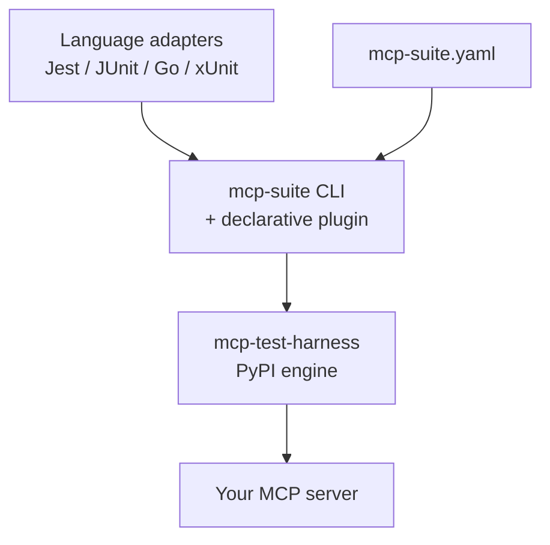

# Architecture (mcp-test-suite)

This repo is a **connector layer**. Execution internals live in **mcp-test-harness** (PyPI).

## Mental model



PNG: [images/architecture-suite.jpg](images/architecture-suite.jpg)

## What lives where

| Concern | Repo |
|---------|------|
| Transports, assertions, scheduler, reports, chaos | **mcp-test-harness** |
| Declarative YAML compiler, `mcp-suite` CLI, adapters, Action, suite Docker | **mcp-test-suite** (here) |

Engine deep-dive (discovery → scheduler → session): see the [harness Architecture docs](https://github.com/vaquarkhan/mcp-test-harness/blob/main/docs/ARCHITECTURE.md) after you install from PyPI.

## Upgrades

```bash
pip install -U "mcp-test-harness>=3.0.9"
# rebuild suite image to pick up a new engine pin
docker build -t mcp-test-suite:local .
```

No engine source is copied into this tree — see [NO_PYPI_FROM_THIS_REPO.md](NO_PYPI_FROM_THIS_REPO.md).
