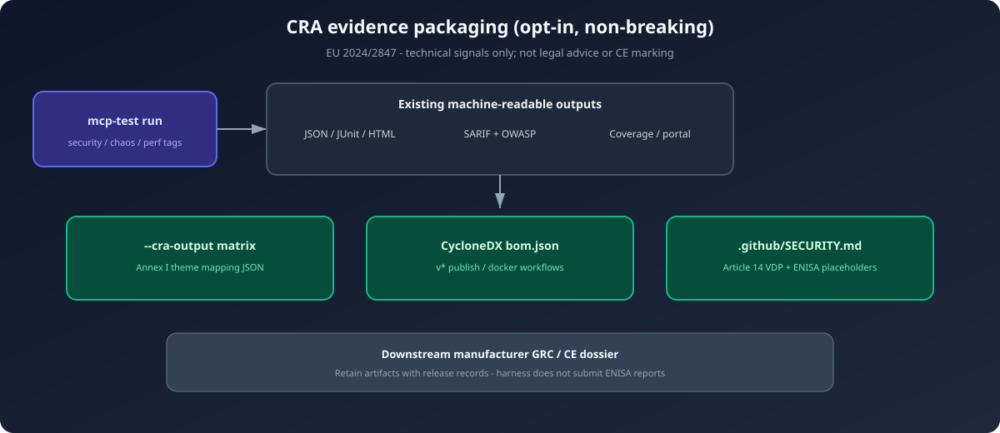

# CRA compliance (EU Cyber Resilience Act)

> **Important:** operational guidance for using MCP Test Harness as **technical evidence** in a CRA program — **not legal advice**, not a Notified Body assessment, and not a CE mark.

Regulation **(EU) 2024/2847** requires security-by-design, vulnerability handling, and supply-chain transparency for Products with Digital Elements (PDEs). This harness already provides strong **pre-production** technical gates (schema, security payloads, SARIF, chaos/resiliency, SLOs). CRA alignment for *this repository* focuses on three **non-breaking** additions:

| Gap | Remediation in this repo |
|-----|--------------------------|
| SBOM | CycloneDX `bom.json` on `v*` publish workflows (artifact upload, fail-safe) |
| Vulnerability handling (Art. 14) | [`.github/SECURITY.md`](../.github/SECURITY.md) VDP + ENISA coordination placeholders |
| Conformity evidence packaging | Opt-in `--cra-output` conformity matrix JSON |

Companion runtime defense remains [MCP-Bastion](https://github.com/vaquarkhan/MCP-Bastion) — out of scope here.

<p align="center">
  
</p>

## Opt-in CRA conformity matrix

Tag tests with existing markers (`security`, `chaos`, `resiliency`, `perf`, `smoke`, …). After a run:

```bash
mcp-test --server-command "python -m your_server" \
  --cra-output reports/cra_conformity_matrix.json \
  tests/
```

Or in `mcp-test.yaml`:

```yaml
report:
  format: json
  output: reports/mcp-test.json
  cra_output: reports/cra_conformity_matrix.json
  sarif_output: reports/findings.sarif
```

The matrix maps tag families to Annex I themes (`cra_article`, `requirement_description`, `tests_executed`, `pass_rate`, `evidence_link`, `status`). Empty themes report `no_evidence` rather than inventing coverage.

## SBOM on release

On each `v*` tag:

1. `publish.yml` builds the wheel/sdist, then generates CycloneDX JSON from `pyproject.toml` and uploads `bom.json`.
2. `docker-publish.yml` generates a CycloneDX SBOM for the Python project context and uploads `bom-docker.json` after image push.

SBOM steps use `continue-on-error: true` so PyPI/GHCR publication is never blocked by SBOM tooling.

## What this does *not* do

- Replace your product’s CRA classification (Default / Important / Critical)
- Submit ENISA reports for you
- Sign or notarize releases by itself
- Change harness transport, fixtures, or assertion semantics

See also: [ENTERPRISE_GOVERNANCE.md](ENTERPRISE_GOVERNANCE.md) (EU AI Act + broader GRC), [SECURITY_TESTING.md](SECURITY_TESTING.md).
