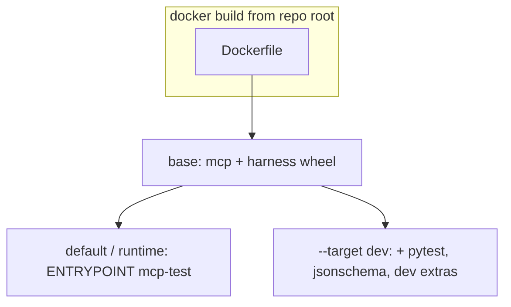

# Docker and OCI images

MCP Test Suite ships a [Dockerfile](../Dockerfile) at the repository root. Use it to run **`mcp-test` in a reproducible, Python-isolated** environment (CI, air-gapped runners, or teams that standardize on containers instead of a local venv).

## Find images and packages

| What | Link |
|------|------|
| **PyPI engine** | [https://pypi.org/project/mcp-test-harness/](https://pypi.org/project/mcp-test-harness/) |
| **This repo’s `Dockerfile` (source of truth)** | Local file: [Dockerfile](../Dockerfile) |
| **GitHub** — source, Issues, **Packages** (container images) | [Repository](https://github.com/vaquarkhan/mcp-test-suite) · [Packages for this repo](https://github.com/vaquarkhan/mcp-test-suite/pkgs/container/mcp-test-suite) |
| **GHCR (pre-built images)** | Target image: `ghcr.io/vaquarkhan/mcp-test-suite:latest` — will exist after the first **`v*`** image publish by [`.github/workflows/docker-publish.yml`](../.github/workflows/docker-publish.yml). |
| **Docker product docs** (install, `docker run`, volume mounts) | [https://docs.docker.com/](https://docs.docker.com/) |

**Note:** PyPI is **not** published from this repo. Pushing a **`vX.Y.Z`** tag can publish **GHCR** via [`docker-publish.yml`](../.github/workflows/docker-publish.yml). You can always **build locally** with the [Dockerfile](../Dockerfile) (below).

## Image targets (one Dockerfile, two use cases)



| Target | `docker build` | Typical use |
|--------|----------------|-------------|
| **runtime** (default last stage) | `docker build -t mcp-test-suite:local .` | Smallest image: run `mcp-test` against a mounted project. |
| **dev** | `docker build -t mcp-test-suite:dev --target dev .` | Run `pytest` / coverage inside the container against a mounted tree. |

## Build and run locally

From the repository root:

```bash
docker build -t mcp-test-suite:local .
docker run --rm mcp-test-suite:local --version
```

Run the harness against the current directory (POSIX; see root [README](../README.md#docker) for PowerShell):

```bash
docker run --rm -v "$PWD":/work -w /work mcp-test-suite:local .
```

**Dev / tests:**

```bash
docker build -t mcp-test-suite:dev --target dev .
docker run --rm -v "$PWD":/work -w /work --entrypoint pytest mcp-test-suite:dev tests/ -q
```

## GHCR in CI (implemented)

On **`v*`** tags, [`.github/workflows/docker-publish.yml`](../.github/workflows/docker-publish.yml) pushes:

- **Runtime:** `ghcr.io/vaquarkhan/mcp-test-suite:<semver>` and `:latest`
- **Dev:** `ghcr.io/vaquarkhan/mcp-test-suite:<semver>-dev` and `:dev`

One-time GitHub **Actions** workflow permission **Read and write** is required so `GITHUB_TOKEN` can push packages. Maintainer checklist: [RELEASING.md](RELEASING.md).

**Related:** [CHANGELOG](../CHANGELOG.md) · [Contributing / tests in Docker](../CONTRIBUTING.md) · [Discovery checklist](DISCOVERY.md).
