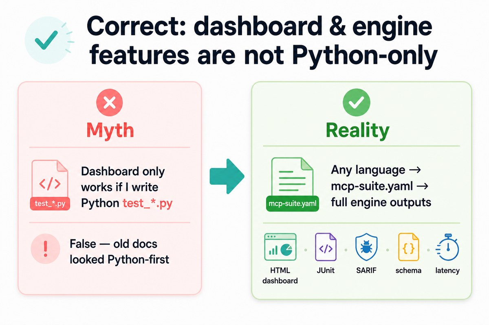

# Multi-language adoption (mcp-test-suite)

**Package downloads (v4.0.0):**
[Python / PyPI](https://pypi.org/project/mcp-test-harness/) ·
[Java JAR](https://github.com/vaquarkhan/mcp-test-suite/releases/download/v4.0.0/mcp-test-suite-junit5-4.0.0.jar) ·
[Node / npm tgz](https://github.com/vaquarkhan/mcp-test-suite/releases/download/v4.0.0/vaquarkhan-mcp-test-suite-jest-4.0.0.tgz) ·
[Go module](https://pkg.go.dev/github.com/vaquarkhan/mcp-test-suite/adapters/gotest@v4.0.0) ·
[.NET nupkg](https://github.com/vaquarkhan/mcp-test-suite/releases/download/v4.0.0/McpTestSuite.Xunit.4.0.0.nupkg) ·
[All release assets](https://github.com/vaquarkhan/mcp-test-suite/releases/tag/v4.0.0) ·
[Install guide](DOWNLOADS.md)

**mcp-test-suite** is the multi-language connector layer on top of [mcp-test-harness](https://github.com/vaquarkhan/mcp-test-harness) (PyPI). Non-Python teams share `mcp-suite.yaml` and native adapters.

## Architecture

```
┌──────────────────────────────────────────────────────────────────────┐
│  Native adapters (this repo)                                           │
│  Jest │ JUnit5 │ Go │ xUnit │ Python API │ Rust via CLI                │
└────────────────────────────┬───────────────────────────────────────────┘
                             ▼
                      mcp-suite.yaml  (shared contracts)
                             ▼
              mcp-suite CLI  (+ declarative plugin)
                             ▼
              mcp-test-harness  ←── pip / PyPI (main engine repo)
                             ▼
     MCP server (Spring, Nest, FastAPI, .NET, Rust, Go, …)
```

Diagram: [images/architecture-suite.jpg](images/architecture-suite.jpg) · Multi-language: [images/multi-language-suite.jpg](images/multi-language-suite.jpg)

## Same features as Python — for every language

The engine’s **HTML dashboard**, JUnit/JSON/SARIF, schema/latency checks, and conformance are produced by **mcp-test-harness**.  
**mcp-test-suite** unlocks that stack for TypeScript, Java, Go, .NET, Rust, etc. through `mcp-suite.yaml` — you are not limited to Python `test_*.py`.



```bash
mcp-suite run --suite mcp-suite.yaml --report-format html --report-output report.html
```

## Paths to adoption

| Audience | How to test | Tutorial |
|----------|-------------|----------|
| Any language | `mcp-suite run --suite …` | [tutorials/yaml.md](tutorials/yaml.md) |
| Node / Nest / Express / Fastify | `@vaquarkhan/mcp-test-suite-jest` | [tutorials/typescript.md](tutorials/typescript.md) |
| Java / Spring / Quarkus / Micronaut | `mcp-test-suite-junit5` | [tutorials/java.md](tutorials/java.md) |
| Kotlin Spring / Ktor | Same JUnit 5 adapter | [tutorials/java.md](tutorials/java.md) |
| Go | `adapters/gotest` | [tutorials/go.md](tutorials/go.md) |
| .NET | `adapters/xunit` | [tutorials/dotnet.md](tutorials/dotnet.md) |
| Python | YAML and/or `test_*.py` | [tutorials/python.md](tutorials/python.md) |
| Rust | YAML + `cargo test` | [tutorials/rust.md](tutorials/rust.md) |
| CI | Universal GitHub Action | [CI_AND_REPORTS.md](CI_AND_REPORTS.md) |

## Framework example packs

**[examples/frameworks/](../examples/frameworks/)** — each pack has its own `mcp-suite.yaml` + README.

```bash
mcp-suite run --suite examples/frameworks/<lang>/<framework>/mcp-suite.yaml \
  --server-command "<see each README>"
```

## Docker

```bash
docker build -t mcp-test-suite:local .
docker run --rm -v "$PWD":/work -w /work mcp-test-suite:local \
  run --suite mcp-suite.yaml --server-command "node build/index.js"
```

Image installs **mcp-test-harness from PyPI** at build time. See [DOCKER.md](DOCKER.md).

## IDE & AI assistants

[IDE_INTEGRATION.md](IDE_INTEGRATION.md) — Cursor, Kiro, Google Antigravity, Gemini, ChatGPT, Codex, VS Code, Copilot, Windsurf, JetBrains, Zed, and terminal editors.  
Cursor-only details: [CURSOR_IDE.md](CURSOR_IDE.md) · [`.cursorrules`](../.cursorrules) · [AGENTS.md](../AGENTS.md)
