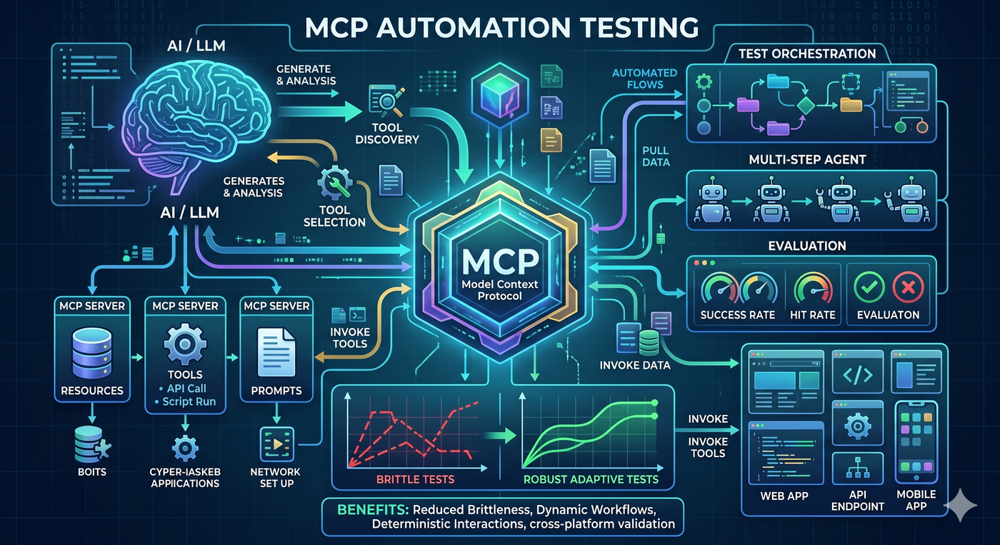

# MCP Test Harness — documentation

**Published-style entry (e.g. GitHub Pages) for the `docs/` folder.** The canonical **hub** with adoption paths and the full table of documents is [README.md](README.md).

| Start here | Link |
|------------|------|
| **Docs hub** (read first) | [README.md](README.md) |
| **Changelog (releases, upgrades)** | [CHANGELOG.md](../CHANGELOG.md) |
| **Contributing** | [CONTRIBUTING.md](../CONTRIBUTING.md) |
| **This repo: dev setup, tests, example index** | [DEVELOPER.md](DEVELOPER.md) |
| **Runnable & copy-paste examples** | [../examples/README.md](../examples/README.md) |
| **Feature demo packs (functional/regression/performance)** | [../examples/feature-demo/README.md](../examples/feature-demo/README.md) |
| **Docker & container links** (PyPI, GitHub Packages, `docker run`) | [DOCKER.md](DOCKER.md) |
| **Architecture (Mermaid diagrams)** | [ARCHITECTURE.md](ARCHITECTURE.md) |
| **Visual Studio Code & Cursor** | [EDITORS.md](EDITORS.md) |
| **Markdown: highlight features** (GitHub alerts) | [MARKDOWN_CONVENTIONS.md](MARKDOWN_CONVENTIONS.md) |
| **Fastest install + first run** | [QUICK_START.md](QUICK_START.md) |
| **Stateful tutorial** | [TUTORIAL.md](TUTORIAL.md) |
| **Stateless MCP tutorial (SEP-2575)** | [TUTORIAL_STATELESS.md](TUTORIAL_STATELESS.md) · [RFC-006](design/RFC-006-stateless-mcp.md) |
| **Ecosystem, registries, promotion checklist** | [DISCOVERY.md](DISCOVERY.md) |
| **How we compare to other MCP tools** | [COMPARISON.md](COMPARISON.md) |
| **Product roadmap** | [ROADMAP.md](ROADMAP.md) |
| **Security testing strategy** | [SECURITY_TESTING.md](SECURITY_TESTING.md) |
| **CRA compliance (SBOM, VDP, `--cra-output`)** | [CRA_COMPLIANCE.md](CRA_COMPLIANCE.md) · [`.github/SECURITY.md`](../.github/SECURITY.md) |
| **Contract + compatibility strategy** | [CONTRACT_AND_COMPAT.md](CONTRACT_AND_COMPAT.md) |
| **Enterprise governance notes** | [ENTERPRISE_GOVERNANCE.md](ENTERPRISE_GOVERNANCE.md) |
| **Plugin registry (proposed)** | [PLUGIN_REGISTRY.md](PLUGIN_REGISTRY.md) |
| **Using an LLM to help write tests** | [LLM_TEST_GENERATION.md](LLM_TEST_GENERATION.md) |
| **Postman-style collections and multi-step flows** | [COLLECTIONS.md](COLLECTIONS.md) |
| **PyPI + Docker (GHCR) release** | [RELEASING.md](RELEASING.md) |
| **Root project README** (features, Docker, CLI) | [../README.md](../README.md) |

**Repository:** [github.com/vaquarkhan/mcp-test-harness](https://github.com/vaquarkhan/mcp-test-harness) · **PyPI:** [mcp-test-harness](https://pypi.org/project/mcp-test-harness/)

  

